# MCP 入门：从模型上下文到 AI Agent 的标准连接协议

> **文档性质**：面向初学者的技术导论
> **适用读者**：Linux 应用运维工程师、SRE、AI Infra / LLMOps 工程师、AI Agent 应用开发者
> **版本基准**：MCP 规范 2026-07-28（截至 2026 年 9 月的最新正式版本）
> **文档作者**：马哥教育（http://www.magedu.com）
> **版权说明：**原创文档，转载必须经过作者同意

---

## 前言

本文系统介绍 Model Context Protocol（MCP，模型上下文协议）的基本概念、架构模型、协议机制与演进历程。全文遵循"先背景、后架构、再细节"的递进结构：

- **第 1～2 章**回答"为什么"与"是什么"：MCP 要解决什么问题，它在大模型应用演进中处于什么位置，其核心角色与能力模型是什么；
- **第 3 章**介绍协议与传输机制：JSON-RPC 2.0 消息格式、stdio 与 Streamable HTTP 两种传输方式，以及一次 Tool Call 的完整链路；
- **第 4 章**回答"发展到哪一步了"：MCP 的版本演进与 2026 年的架构级变化；
- **第 5 章**集中澄清初学者最容易混淆的概念边界；
- **第 6 章**通过 SRE 场景案例说明 MCP 的典型价值，并讨论其安全治理；
- **第 7 章**给出循序渐进的实验路径与最小闭环实验的关键步骤。

读完本文后，读者应能建立完整、正确的 MCP 心智模型，并为后续的 MCP Server 开发与生产落地打下基础。

---

# 第一章　背景与动机

## 1.1 MCP 是什么

### 1.1.1 定义

**MCP（Model Context Protocol，模型上下文协议）是一套让 AI 应用以统一方式连接外部数据、工具和服务的开放协议**，其底层消息格式基于 JSON-RPC 2.0。截至 2026 年，MCP 官方将其定义为一种开放协议：用于让 LLM 应用以标准方式连接外部数据源与工具，并构建可组合的 AI 工作流。

### 1.1.2 问题的提出

大语言模型本身只根据输入进行推理并生成文本，缘于自身的限制，它天然无法了解：

- 企业数据库里有什么数据；
- Prometheus 当前有哪些监控指标；
- Kubernetes 集群里有哪些 Pod；
- GitHub 仓库里有哪些代码；
- 文件系统里有哪些文件；
- 内部业务 API 如何调用。

在传统模式下，每连接一个外部系统，就需要单独编写一套集成代码：

```text
LLM → Prometheus API
LLM → GitHub API
LLM → Kubernetes API
LLM → MySQL
LLM → 文件系统
LLM → Jira
```

于是，某个AI应用若连接 20 个系统，就可能需要维护 20 套不同的接入方式。

### 1.1.3 MCP 的解决思路

MCP 将各类外部系统统一包装为 **MCP Server**，AI 应用则通过统一的 **MCP Client** 与之通信。集成结构由"多对多适配器"转变为"统一协议层"：

```text
转变前：
AI Application
   ├── Prometheus Adapter
   ├── GitHub Adapter
   ├── MySQL Adapter
   ├── Kubernetes Adapter
   ├── Jira Adapter
   └── Filesystem Adapter

转变后：
AI Application
      │
      │ MCP
      ▼
 ┌──────────────────────────────┐
 │        MCP Servers           │
 ├──────────────────────────────┤
 │ Prometheus MCP Server        │
 │ GitHub MCP Server            │
 │ MySQL MCP Server             │
 │ Kubernetes MCP Server        │
 │ Filesystem MCP Server        │
 │ Jira MCP Server              │
 └──────────────────────────────┘
```

## 1.2 为什么会出现 MCP：大模型应用的三个阶段

理解 MCP，需要先理解大模型应用能力演进的三个阶段。

### 1.2.1 第一阶段：LLM 作为"聊天机器人"

最早的大模型应用是纯粹的问答模式：

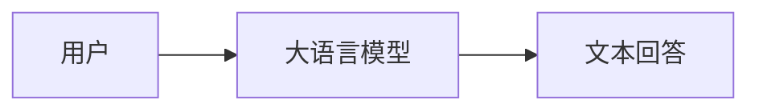

例如，用户提问"Linux 中如何查看磁盘空间"，模型可凭借训练知识回答 `df -h`。这类问题不需要访问真实系统。但如果问题是"我的服务器现在磁盘空间是多少"，模型就无法回答。根本原因在于**模型知道“怎么查”，不等于模型真的能“查”。**

### 1.2.2 第二阶段：RAG 让模型"读取外部知识"

RAG（Retrieval-Augmented Generation，检索增强生成）通过外挂知识库，使模型能够回答企业私有知识问题：

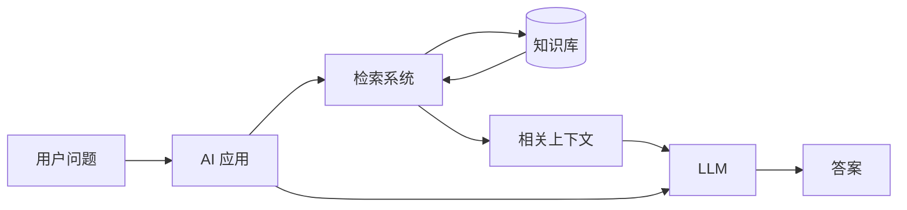

企业可将产品文档、运维文档、故障手册、Wiki、FAQ 等建设为知识库，模型据此回答内部问题。但 RAG 主要解决的是**读数据**的问题，它不能很好地解决"查询 Prometheus、重启 Pod、创建工单、执行 SQL、发送邮件、修改配置"这类**执行操作**的问题。

### 1.2.3 第三阶段：Tool Calling 让模型"做事情"

随后，大模型逐渐支持 Function Calling / Tool Calling。以天气查询为例，当应用告知模型存在工具 `get_weather(city)`，用户问"北京天气怎么样"时，模型不直接回答，而是生成结构化的调用请求：

```json
{
  "name": "get_weather",
  "arguments": {
    "city": "Beijing"
  }
}
```

应用程序据此调用天气 API，再将结果交回模型生成最终回答：

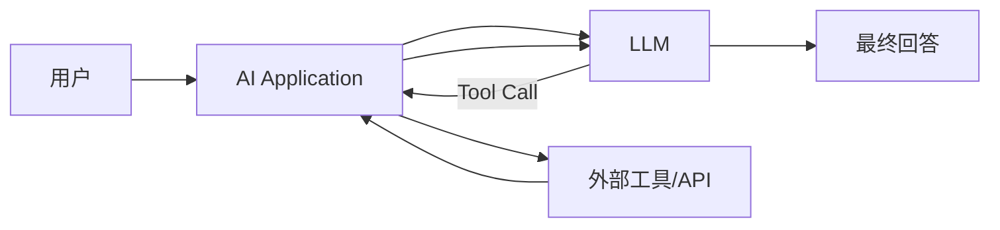

这是 Agent 能够真正操作外部世界的重要基础。

### 1.2.4 Tool Calling 带来的新问题：M × N 集成困境

假设一个 AI 应用需要接入 GitHub、GitLab、Slack、Prometheus、Grafana、Kubernetes、MySQL、PostgreSQL、Jira、AWS、VMware、内部 CMDB 等系统，传统方式为每个系统单独编写 Adapter：

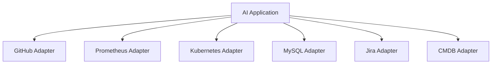

每个 Adapter 都要处理认证方式、API 格式、Tool Schema、错误处理、权限控制、连接生命周期、参数与返回格式等差异。由此产生经典的 **M × N 集成问题**：M 个 AI 应用 × N 个外部系统，理论上需要 M × N 套集成：

```text
Claude × GitHub        Claude × PostgreSQL      Claude × Prometheus
Dify   × GitHub        Dify   × PostgreSQL      Dify   × Prometheus
IDE Agent × GitHub     IDE Agent × PostgreSQL   IDE Agent × Prometheus
```

MCP 的核心思想是：**双方都实现同一套协议**，将集成复杂度从 M × N 降为 M + N：

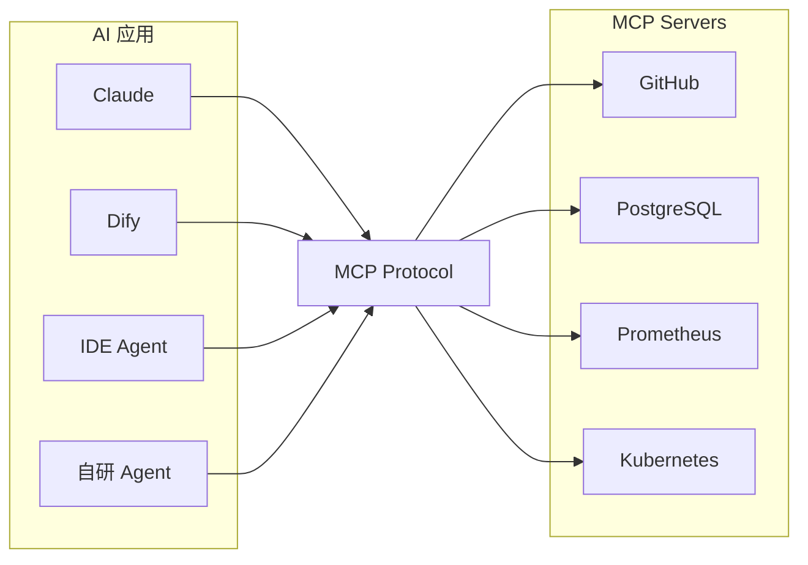

> **这就是 MCP 最重要的价值：把"AI 如何连接外部世界"标准化。**

MCP 官方明确说明其设计受到 Language Server Protocol（LSP）的启发：LSP 解决了"不同编辑器 × 不同编程语言"的重复集成问题，MCP 则希望对"AI 应用 × 外部上下文与工具"完成类似的标准化。

---

# 第二章　核心概念与架构

## 2.1 MCP 的诞生与版本演进

### 2.1.1 诞生背景

MCP 由 Anthropic 于 **2024 年 11 月 25 日**正式开源发布，同时开放了协议规范、SDK 和多个参考 MCP Server。Anthropic 当时提出的核心问题是：

> AI 模型越来越强，但模型仍然被隔离在数据孤岛之外；每接入一个数据源都需要定制开发。

因此 MCP 最初定位为"AI Assistant —（Standard Protocol）→ External Context / Data / Tools"，其命名中的 Model / Context / Protocol 也表明，**最初的重点是如何标准化地把 Context 提供给模型**。

随后，MCP 很快从 Context Protocol 演进为更广义的 **Agent Integration Protocol**——不仅"给模型看数据"，还让模型能够调用工具、执行操作、请求用户输入、运行长任务，甚至呈现交互式 UI。

### 2.1.2 版本演进脉络

理解 MCP 的版本历史非常重要，因为网络上大量教程针对的是旧版本规范。截至 2026 年 9 月，最新正式规范为 **MCP 2026-07-28**（官方 `/specification/latest` 亦指向该版本）。

| 时间       | 重要变化                                                    | MCP 的核心定位                |
| ---------- | ----------------------------------------------------------- | ----------------------------- |
| 2024-11-25 | MCP 正式发布                                                | 统一 Context / Tool 接入      |
| 2025-03-26 | Streamable HTTP 等重要传输机制演进                          | 从本地走向 Remote MCP         |
| 2025-06-18 | Structured Tool Output、Elicitation、OAuth 安全增强         | Agent 能力增强                |
| 2025-11-25 | Tasks（实验性）、认证体系与扩展能力继续发展                 | 面向复杂 Agent 工作流         |
| 2026-07-28 | Stateless Core、MRTR、Extensions、MCP Apps、Tasks Extension | 面向大规模生产 Agent 基础设施 |

其中：

- **2025-06-18** 引入结构化 Tool Output 与 Elicitation，并进一步加强 OAuth 与协议安全模型；
- **2025-11-25** 继续增强认证机制，并首次将 Tasks 作为实验能力引入，为长时间运行的任务提供标准抽象；
- **2026-07-28** 是 MCP 发布以来规模最大的架构级变化之一，核心是从 Stateful Protocol 转向 **Stateless Protocol Core**，同时引入 Multi Round-Trip Requests（MRTR）、Header-based Routing、可缓存的 List 结果和正式的 Extensions 框架，使 MCP 更适合大规模、负载均衡和云原生生产环境。

## 2.2 MCP 总体架构：Host、Client 与 Server

### 2.2.1 三个核心角色

MCP 官方规范定义了三个基本角色：**Host、Client、Server**。整体架构如下：

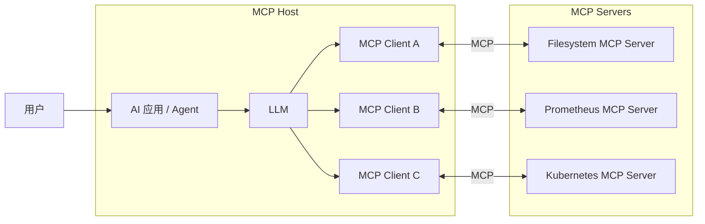

### 2.2.2 Host：承载 Agent 与 Client 的应用程序

Host 是**承载 AI Agent 和 MCP Client 的应用程序**，典型实例包括 Claude Desktop、Dify、AI IDE、自研 Agent 平台、企业 AI Assistant 等。

Host 通常负责：用户界面、LLM 调用、Prompt 管理、MCP Client 管理、权限控制、Tool Calling、上下文组织。例如在"Dify + MCP"架构中，Dify 即为 Host。

### 2.2.3 MCP Client：Host 内部的协议客户端

MCP Client 是 **Host 内部负责与某个 MCP Server 通信的协议客户端**：

```text
Dify
 │
 ├── MCP Client → Prometheus MCP Server
 ├── MCP Client → Kubernetes MCP Server
 └── MCP Client → GitHub MCP Server
```

Client 的主要职责包括：连接 Server、发现 Server 能力、获取 Tool 定义、发送 Tool Call、读取 Resource、读取 Prompt、处理 Server 返回结果。

需要特别强调的是，**MCP Client并不等同于LLM。** LLM 负责决定“要不要调用工具”，而MCP Client 负责“按照 MCP 协议真正调用工具”。

### 2.2.4 MCP Server：系统能力的标准化封装

MCP Server 是**将某个系统的能力按照 MCP 标准暴露出来的服务**：

```text
Prometheus API
      │
      ▼
Prometheus MCP Server
      │
      ▼
MCP Client
```

以 Prometheus MCP Server 为例，它可能提供 `query_prometheus`、`query_range`、`list_metrics`、`get_targets`、`get_alerts` 等 Tool。模型无需理解 `/api/v1/query`、`/api/v1/query_range`、`/api/v1/targets` 等原始 HTTP 端点，只需理解 `query_prometheus()` 这样的语义化工具。

## 2.3 MCP Server 的三类核心能力

长期以来，MCP Server 最重要的三种抽象是 **Tools、Resources、Prompts**：

| 能力      | 简单理解         | 典型用途                  |
| --------- | ---------------- | ------------------------- |
| Resources | 给模型"看东西"   | 文件、文档、数据库内容    |
| Tools     | 让模型"做事情"   | 查 API、执行操作、计算    |
| Prompts   | 给用户"使用模板" | 固定分析流程、Prompt 模板 |

### 2.3.1 Resources：让 AI 获取上下文

Resource 是 **MCP Server 暴露给 AI 的可读取数据**，以 URI 形式标识，例如：

```text
file:///etc/nginx/nginx.conf
postgres://database/schema
logs://application/error
```

其交互逻辑为：

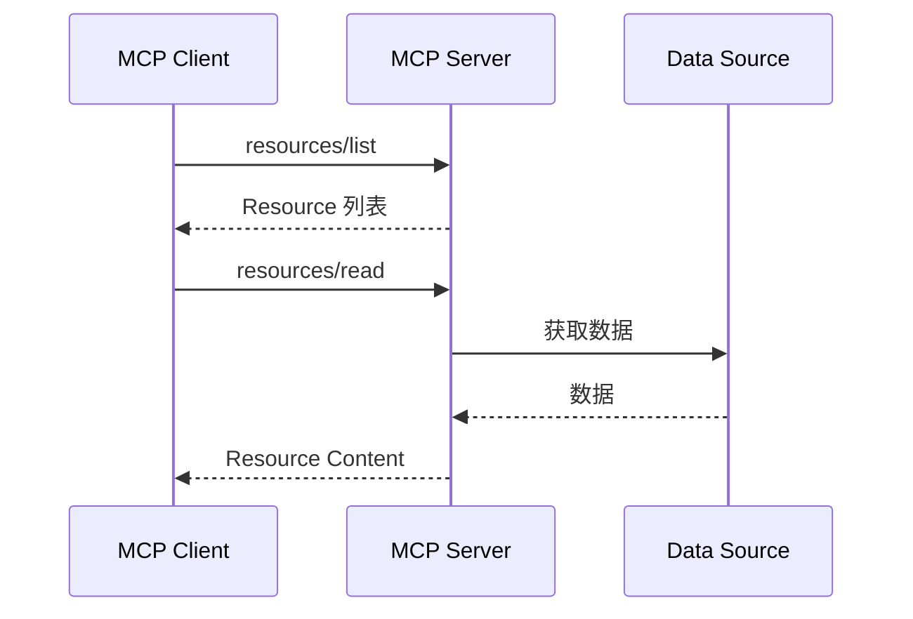

Resources 的核心特点是 **Read Context**——读取已有数据。

### 2.3.2 Tools：让 AI 执行动作

Tools 是 MCP 在 Agent 场景中最重要的能力。一个 Tool 由"Function + Schema + Description"构成，例如：

```json
{
  "name": "query_prometheus",
  "description": "Execute a PromQL query",
  "inputSchema": {
    "type": "object",
    "properties": {
      "query": {
        "type": "string"
      }
    }
  }
}
```

LLM 看到该定义后即知道：存在一个名为 `query_prometheus` 的工具，需要一个 `query` 参数，于是可以生成调用 `query_prometheus(query="up{job='vllm'}")`。协议层面上，Client 通过 `tools/list` 发现工具，通过 `tools/call` 调用工具。

### 2.3.3 Prompts：Server 提供的预定义 Prompt 模板

Prompts 常被初学者忽略。它不是用户随意输入的 Prompt，而是 **MCP Server 暴露的预定义 Prompt 模板**。例如 Kubernetes MCP Server 可提供模板 `analyze_pod_failure`：

```text
Analyze why pod {{pod_name}} in namespace {{namespace}}
is failing.
```

Client 通过 `prompts/list` 发现模板，通过 `prompts/get` 获取模板内容。官方将 Prompts 定位为偏 **user-controlled** 的能力（用户通常显式选择使用某个 Prompt）；与此对应，Tools 更偏 **model-controlled**（由模型判断何时调用）。

### 2.3.4 三类能力的区别与协作

初学阶段可以记住三句话：

```text
Resource → 给模型看东西
Prompt   → 告诉模型怎么思考/处理
Tool     → 让模型做事情
```

以 SRE 故障分析场景为例：

```text
Resource → 故障处理手册
Prompt   → "按照 SRE Incident 流程分析告警"
Tool     → query_prometheus()
```

三者在一次告警分析中的协作关系：

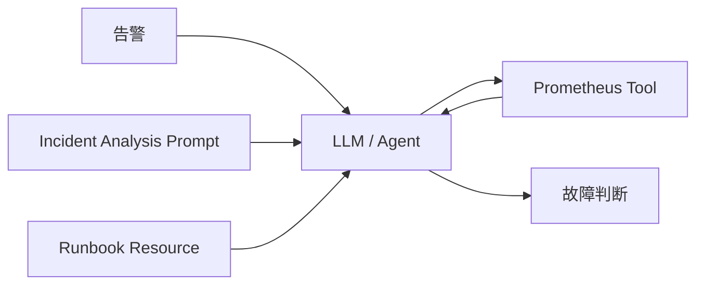


---

# 第三章　协议与传输机制

## 3.1 通信协议基础

### 3.1.1 消息格式：JSON-RPC 2.0

MCP 的消息格式基于 **JSON-RPC 2.0**。官方当前保留两种标准传输方式：

- **stdio**：适用于本地 MCP Server；
- **Streamable HTTP**：适用于远程 MCP Server。

### 3.1.2 stdio 传输

stdio 最适合本地 MCP Server。Server 本质上是 Host 启动的本地子进程，双方通过标准输入/输出通信：

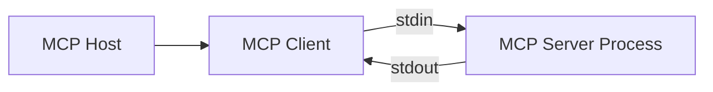

例如 Claude Desktop 在本地启动 filesystem MCP Server。stdio 的优点是：简单、无需监听网络端口、适合本地工具。

### 3.1.3 Streamable HTTP 传输

远程 MCP Server 更常使用 **Streamable HTTP**：

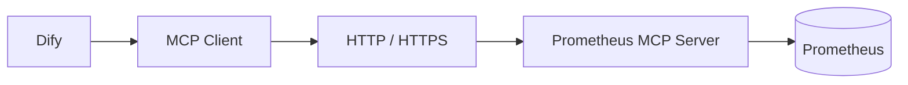

Server 通常以 `https://magedu.com/mcp` 形式提供 MCP Endpoint。

> **版本提示**：早期 MCP 曾采用 HTTP+SSE Transport；后续 Streamable HTTP 成为主要的远程传输模式，旧的 HTTP+SSE 已进入弃用路径。

## 3.2 一次 MCP Tool Call 的完整链路

假设用户提问"vLLM 当前平均 TTFT 是多少"，完整调用过程如下：

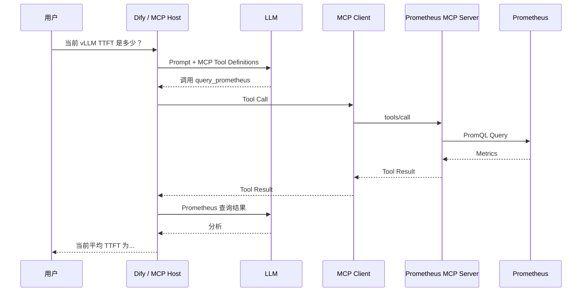

其中非常关键的一点是**LLM 通常并不直接连接 MCP Server**，实际链路为：

```text
LLM
 ↓
AI Application / Agent Runtime
 ↓
MCP Client
 ↓
MCP Server
 ↓
真实系统
```

---

# 第四章　2026 年的架构演进与新能力

## 4.1 扩展能力：Sampling、Roots 与 Elicitation

传统的 MCP 心智模型是"Server 提供 Resources / Tools / Prompts"。2025 年的规范又引入了三个新能力：

- **Sampling**：允许 Server 请求 Client 使用模型完成一次生成；
- **Roots**：用于告知 Server 可以操作的文件系统边界；
- **Elicitation**（2025-06-18 正式引入）：允许 Server 在执行过程中请求用户补充信息。

Elicitation 的典型流程：

```text
部署应用
 ↓
MCP Tool
 ↓
需要知道 namespace
 ↓
请求用户提供 namespace
 ↓
用户：production
 ↓
继续执行
```

## 4.2 2026-07-28：从 Stateful 到 Stateless 的架构重构

### 4.2.1 核心变化

在 2025 年及更早的教程中，经常会看到 `initialize`、`initialized`、session、`sampling/createMessage`、`roots/list`、`elicitation/create` 等概念。**MCP 2026-07-28 对协议模型进行了重要重构**，最核心的变化是：

```text
Stateful Connection
       ↓
Stateless Requests
```

即 MCP 核心协议不再依赖隐式 Session 保存状态。

### 4.2.2 架构对比

旧架构下，Server 需要共享 Session 状态，负载均衡依赖 Sticky Session：

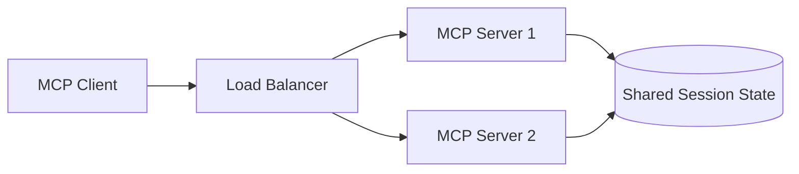

2026 架构中，每个请求更加 **self-contained**，可直接采用 Round-Robin 负载均衡，不再强制依赖 Sticky Session 或 Shared Session Store：

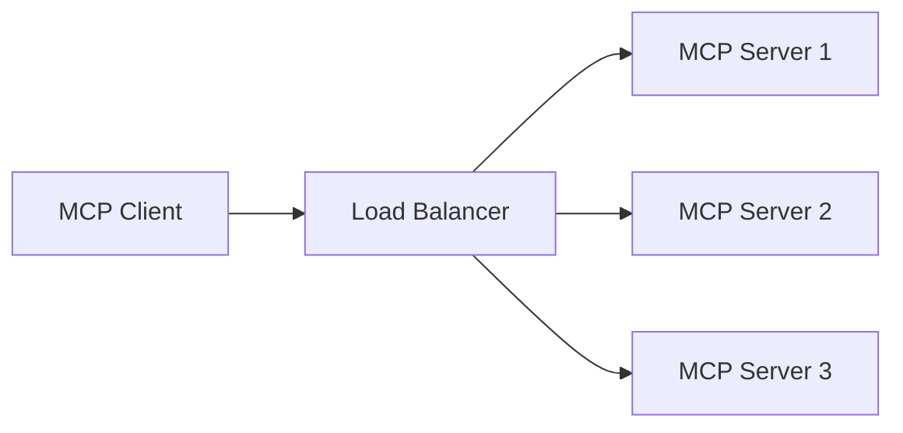

这是 MCP 从"桌面 Agent 协议"走向**大规模云原生 Agent 基础设施**的关键一步。

### 4.2.3 MRTR：Stateless 模型下的多轮交互

Stateless 化带来一个问题：如果 Tool 执行过程中需要用户确认，旧模型下 Server 可通过长连接主动反向调用 Client，而在 Stateless 模型下这种方式不再适用。为此，2026-07-28 引入 **Multi Round-Trip Requests（MRTR）**：

```text
用户：删除测试 Namespace
      ↓
tools/call
      ↓
MCP Server：input_required —— "确认删除 test namespace？"
      ↓
用户：确认
      ↓
重新 tools/call（携带 inputResponses）
      ↓
MCP Server 执行
```

时序如下：

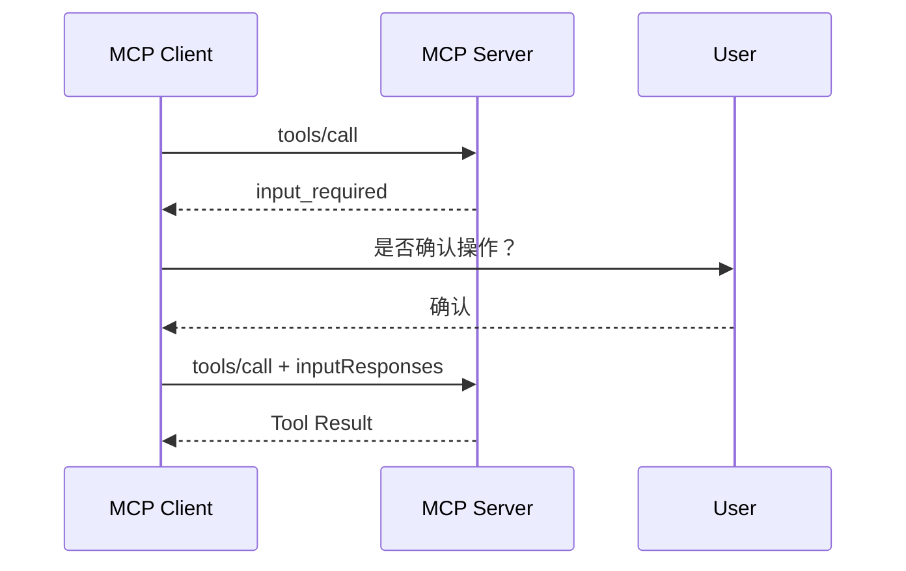

MRTR 使 **Human-in-the-loop** 更容易与 Stateless MCP 配合。

## 4.3 Tasks：面向长时间运行的任务

并非所有 Tool 都能在几百毫秒内完成。扫描大型代码仓库、批量分析日志、执行大规模数据处理、部署 Kubernetes 应用、生成大型报告等操作可能持续数十秒甚至更久。为此 MCP 引入 **Tasks** 抽象：

```text
tools/call
 ↓
立即返回 Task Handle
 ↓
后台任务继续运行
 ↓
tasks/get
 ↓
查询状态
 ↓
获取最终结果
```

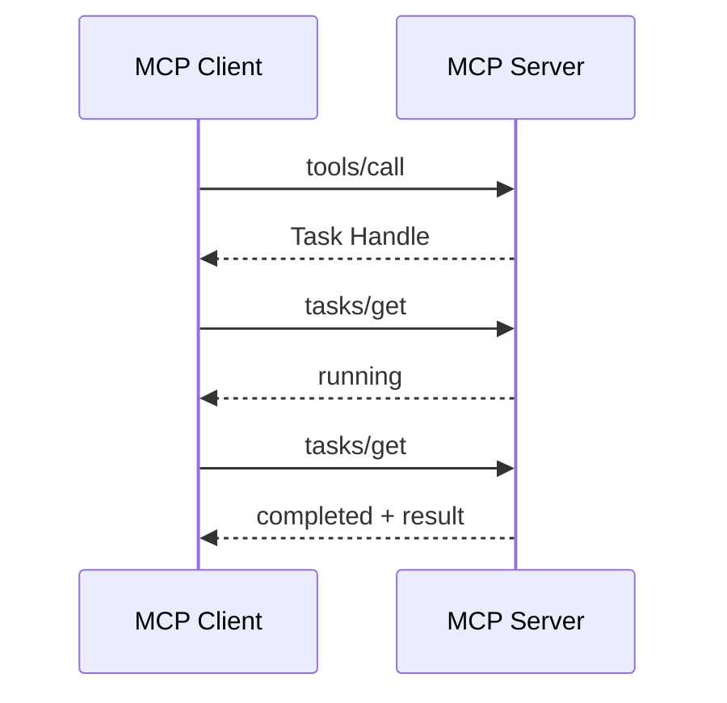

Tasks 于 2025-11-25 首次作为实验性核心能力引入；到 2026-07-28，它被迁移为正式 Extensions 体系中的独立 **Tasks Extension**。

## 4.4 MCP Apps：Tool 不再只能返回文本

传统 Tool 只能返回 JSON / Text，但很多应用实际需要的是 Chart、Form、Table、Dashboard、Video 等交互式 UI。例如用户要求"显示过去 30 分钟 vLLM 的 TTFT"：

```text
传统方式：Tool → JSON → LLM → 文字描述
MCP Apps：Tool → Interactive Chart → 直接显示在 AI 对话界面
```

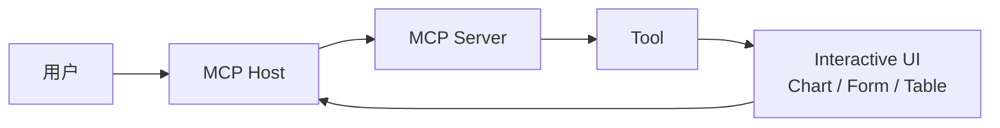

MCP Apps 通过受控 UI 模板，让 Server 可以向 Host 提供可交互界面。2026 版本正式将 Extensions 机制提升为 MCP 架构的一等组成部分，MCP Apps 正是其中的重要扩展。

## 4.5 Extensions 框架：MCP 正在成为模块化协议体系

过去，新增能力往往需要不断修改 MCP 核心协议。2026 年引入 **Extensions Framework** 后，结构变为：

```text
MCP Core
   │
   ├── Tasks Extension
   ├── MCP Apps
   ├── Skills
   └── Future Extensions
```

最新规范明确列出的扩展方向包括 **Tasks、Skills over MCP、MCP Apps**。这些扩展均为 **opt-in**，需要 Client 与 Server 显式声明支持。这种设计意味着 MCP 正逐渐从"一个协议"发展为 **Agent 互操作协议族（Agent Interoperability Protocol Family）**。

## 4.6 完整的 MCP 心智模型

截至 2026 年，不建议再只把 MCP 理解成“LLM 调工具的协议”。更完整的理解是：

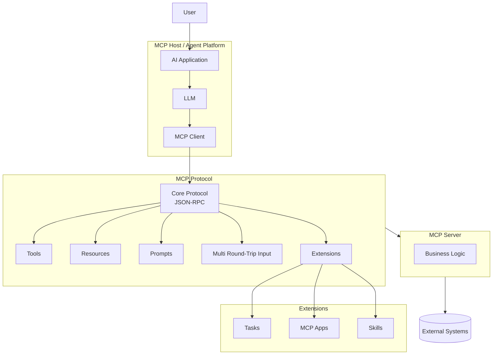


---

# 第五章　概念辨析与生态定位

## 5.1 MCP 与 Function Calling 的关系

这是初学者最容易混淆的问题之一。二者的分工是：

- **Function Calling** 解决：**模型如何表达"我要调用哪个工具"**（模型能力）；
- **MCP** 解决：**AI 应用如何标准化地发现、描述和调用外部能力**（系统集成协议）。

二者配合工作：

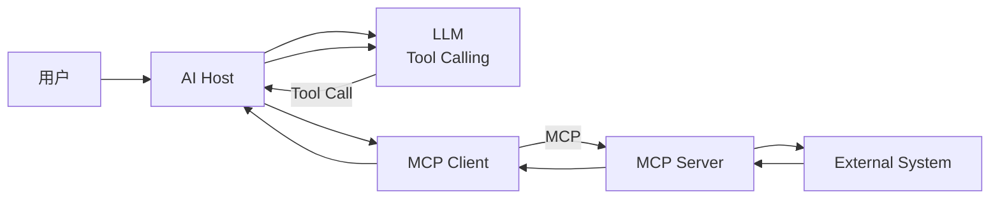

> **结论：MCP 并没有替代 Function Calling，"Function Calling + MCP"共同构成现代 Agent 的工具调用基础。**

## 5.2 MCP 与 REST API 的区别

MCP 并不是为了替代 HTTP API，二者的消费者不同：

- REST API 的消费者：程序员、程序、服务；
- MCP 的消费者：AI Application、Agent Runtime、LLM Tool Calling System。

形式上，REST API 是 `GET /api/v1/query?query=up`，而 MCP Tool 是 `query_prometheus(query="up")`。真正执行时，MCP Server 内部仍然可以调用 REST API：

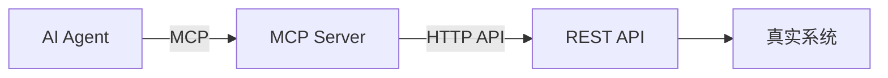

> **MCP 更像是面向 AI 的标准 Adapter 层。**

## 5.3 MCP 与 Agent 的关系

请务必牢记**MCP ≠ Agent**。MCP 本身不会思考、不会自主规划、不会自己判断问题——它只是一个 Protocol。Agent 才是执行"理解目标 → 制定计划 → 选择工具 → 执行工具 → 分析结果 → 继续执行"闭环的决策者。

普通聊天机器人是"Input → LLM → Output"，而 Agent 是"Goal → Think → Use Tool → Observe → Think → Use Tool → … → Result"的循环。因此 Agent 最核心的问题之一是"**Tools 从哪里来**"，MCP 给出的标准答案是 MCP Server：

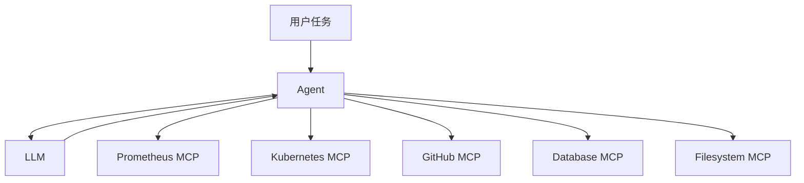

三者的角色可以概括为：

```text
Agent       = 决策者
MCP         = 能力连接机制
MCP Server  = 能力提供者
```

一个形象的类比：LLM / Agent 是"大脑"，MCP 是"神经系统"，MCP Server / Tools 是"手脚和感官"。

## 5.4 MCP 与 API Gateway 的区别

MCP 有时也会与 API Gateway 混淆。二者解决的问题不同：

- **API Gateway**：解决"服务如何访问服务"——认证、路由、限流、负载均衡等；
- **MCP**：关注"AI 如何理解和使用能力"。

二者不是竞争关系，而是不同层次：

```mermaid
flowchart LR

    AGENT[AI Agent]

    MCP[MCP Server]

    GATEWAY[API Gateway]

    API[Business API]

    AGENT -->|AI-friendly protocol| MCP

    MCP -->|HTTP API| GATEWAY

    GATEWAY --> API
```

## 5.5 MCP 在现代 AI 系统中的位置

将一个现代 AI 应用完整展开：

```mermaid
flowchart TB

    USER[用户]

    APP[AI Application<br/>Dify / Agent Platform]

    LLM[LLM]

    RAG[RAG / Knowledge Base]

    MCPCLIENT[MCP Client]

    subgraph MCP["MCP Servers"]
        P[Prometheus]
        K[Kubernetes]
        G[GitHub]
        DB[Database]
    end

    USER --> APP

    APP --> LLM

    APP --> RAG

    APP --> MCPCLIENT

    MCPCLIENT --> P
    MCPCLIENT --> K
    MCPCLIENT --> G
    MCPCLIENT --> DB

    RAG --> LLM
    MCPCLIENT --> LLM
```

各组件的分工：

| 组件          | 职责                              |
| ------------- | --------------------------------- |
| LLM           | Reasoning（推理）                 |
| RAG           | Knowledge（知识）                 |
| MCP           | External Capabilities（外部能力） |
| Agent Runtime | Orchestration（编排）             |

可以用一个公式理解现代 AI Agent：

```text
Agent ≈ LLM + Prompt + Memory + RAG + Tools + Workflow + MCP + Governance
```

其中 MCP 最重要的意义在于：**标准化 Tools 和 Context 与 Agent 之间的连接方式**。

## 5.6 MCP 的长期价值

互联网发展过程中形成了 HTTP、DNS、SMTP、SQL、LSP 等一系列重要协议。这些协议的价值不在于"功能更复杂"，而在于"不同系统终于可以按相同规则协作"。MCP 解决的正是同类问题：

```text
过去：AI App A → Tool A 自定义接口
     AI App B → Tool A 又写一次
     AI App C → Tool A 再写一次

现在：AI Apps ──（MCP）──→ MCP Servers
```

> **MCP 的长期价值不只是"方便调用工具"，而是建立 AI Agent 与数字世界之间的标准能力接口。**

---

# 第六章　场景案例与安全治理

## 6.1 场景案例：用 SRE 视角理解 MCP

假如我们有这样一个需求，也就是收到 vLLM 告警后自动分析问题。在**没有 MCP 时**，Dify需要做到如下任务：

```text
Dify
 │
 ├── 自己写 Prometheus API
 ├── 自己写 Alertmanager API
 ├── 自己写 Kubernetes API
 └── 自己写 vLLM API
```

而**引入 MCP 后**：

```mermaid
flowchart TB

    ALERT[Alertmanager Alert]

    DIFY[Dify Agent]

    LLM[LLM]

    MCP[MCP Client]

    PMCP[Prometheus MCP]

    KMCP[Kubernetes MCP]

    VMCP[vLLM Tool / MCP]

    PROM[(Prometheus)]
    K8S[(Kubernetes)]
    VLLM[(vLLM)]

    ALERT --> DIFY

    DIFY --> LLM

    LLM --> MCP

    MCP --> PMCP
    MCP --> KMCP
    MCP --> VMCP

    PMCP --> PROM
    KMCP --> K8S
    VMCP --> VLLM
```

Agent 可以按以下链路执行诊断：

```text
发现告警
 ↓
query_prometheus()
 ↓
查看 TTFT
 ↓
查看 waiting requests
 ↓
查看 GPU KV Cache
 ↓
查看 GPU utilization
 ↓
查看 Pod 状态
 ↓
分析因果链
 ↓
生成诊断结论
```

这就是 MCP 在 AI-SRE 场景中的典型价值。

## 6.2 MCP 的安全治理

MCP 允许 AI 读取数据、执行命令、修改系统、调用 API，其风险远高于普通 Chatbot。诸如 `restart_pod()`、`delete_database()`、`send_email()`、`deploy_application()` 之类的 Tool 可能产生真实世界的业务影响。

### 6.2.1 官方安全原则

MCP 官方强调四项基本原则：

- **User Consent**（用户知情与同意）
- **Data Privacy**（数据隐私）
- **Tool Safety**（工具安全）
- **Access Control**（访问控制）

官方规范特别指出：Tool 可能代表任意代码执行，因此 Host 应让用户能够理解并控制数据访问和工具调用。

### 6.2.2 工程实践建议

对于具有副作用的 Tool，应设计明确的 **Authorization（授权）、Approval（审批）、Audit（审计）、Least Privilege（最小权限）** 机制。生产环境中可按风险分级：

```text
Read Tool      → 可以自动调用
Write Tool     → 可能需要策略审批
Dangerous Tool → 必须 Human-in-the-loop
```

---

# 第七章　学习路径与动手实验

## 7.1 版本提示：哪些旧模式不应再重点学习

MCP 演进速度很快，初学者极易被旧教程误导。看到以下内容时需特别注意其适用版本：

```text
HTTP+SSE
Mcp-Session-Id
initialize / initialized
sampling/createMessage
roots/list
长期保持 Session
```

这些在旧版本中可能完全正确，但截至 **MCP 2026-07-28**，核心协议已经 Stateless 化：`initialize/initialized` 与协议级 Session 已被移除；Roots、Sampling 和协议层 Logging 已进入弃用阶段，新实现不建议再围绕这些能力设计。

当前学习 MCP 应优先建立的心智模型是：

```text
Stateless MCP + Streamable HTTP + Tools + Resources + Prompts + MRTR + Extensions
```

## 7.2 推荐的学习路径

不建议一开始就研究 OAuth、MCP Apps、Tasks、分布式 MCP Gateway、企业级安全等复杂主题。更合理的路径是**先掌握最小闭环，再逐步复杂化**：

| 阶段 | 目标           | 内容                                                         |
| ---- | -------------- | ------------------------------------------------------------ |
| 一   | 理解角色       | Host / Client / Server                                       |
| 二   | 理解能力模型   | Tools / Resources / Prompts                                  |
| 三   | 理解协议交互   | `tools/list`、`tools/call`、JSON-RPC                         |
| 四   | 动手实现       | 自研一个 Calculator MCP Server（`add` / `subtract` / `multiply` / `divide`） |
| 五   | 接入 Host      | 将 Calculator MCP 接入 Dify，打通 `User → Dify → LLM → MCP Client → Calculator MCP` |
| 六   | 迁移到真实场景 | 替换为 Prometheus MCP，最终形成 `Alertmanager → Dify → Agent → Prometheus MCP → Prometheus` |

这条路径的学习曲线最平滑。

## 7.3 最小实验：Calculator MCP Server 的关键步骤与要点

### 7.3.1 实验目标

实现一个提供 `add`、`subtract`、`multiply`、`divide` 四个 Tool 的 Calculator MCP Server，并通过 Dify 完成一次端到端调用。

### 7.3.2 关键步骤

1. **定义 Tool**：在 MCP Server 中注册四个工具，每个工具包含名称、描述与 `inputSchema`（两个数值参数）；
2. **启动 Server**：本地实验使用 stdio 传输；远程实验使用 Streamable HTTP，暴露 MCP Endpoint；
3. **Tool 发现**：Host（Dify）侧的 MCP Client 连接 Server，执行 `tools/list`，获得 `add / subtract / multiply / divide` 的工具列表；
4. **Tool 调用**：LLM 根据用户问题（如"12 加 8 等于多少"）决定调用 `add`，Client 通过 `tools/call` 发起调用；
5. **返回结果**：Server 执行计算并将结果沿原链路返回，LLM 组织成自然语言回答。

### 7.3.3 最小闭环的协议视图

```mermaid
sequenceDiagram

    participant D as Dify
    participant M as MCP Server
    participant T as Calculator Tool

    D->>M: tools/list

    M-->>D: add / subtract / multiply / divide

    D->>M: tools/call add(12,8)

    M->>T: add(12,8)

    T-->>M: 20

    M-->>D: 20
```

这个最小实验已经包含了 MCP 最核心的知识链条：

```text
MCP Server → Tool Definition → Tool Discovery（tools/list）
→ Tool Calling（tools/call）→ Tool Result
```

理解该闭环后，再学习 Prometheus、Kubernetes 等复杂 MCP Server，差异仅在于"Tool 数量变多、Tool Schema 变复杂、底层系统变复杂"，MCP 的基本逻辑并没有改变。

## 7.4 验收标准：学完后应达到什么程度

一个真正理解 MCP 的初学者，不一定马上会写复杂的 MCP Server，但看到下面的架构：

```text
Dify → MCP → Prometheus
```

应能立即拆解出完整链路：

1. Dify 是 Host；
2. Dify 内部运行 MCP Client；
3. Prometheus MCP 是 MCP Server；
4. Server 暴露 `query_prometheus` 等 Tools；
5. LLM 通过 Function Calling 决定调用哪个 Tool；
6. Dify 通过 MCP 调用 Server；
7. MCP Server 再访问 Prometheus API；
8. 结果返回 Agent，LLM 根据结果继续分析。

达到这个程度，即已建立正确的 MCP 心智模型。之后再学习 MCP Server 开发、Streamable HTTP、Authentication / Authorization、MRTR、Tasks、MCP Apps、Agent + MCP、AI-SRE + MCP 等进阶主题，就会容易得多。

---

# 结语

MCP 的演进脉络可以概括为三步：

1. 最初解决"**如何把 Context 给模型**"；
2. 随后发展为"**如何让模型使用 Tools**"；
3. 如今正演进为"**如何让 Agent、工具、数据、长任务、用户交互和 UI 以统一的方式协作**"。

因此，不应仅仅把 MCP 看成"一个新的 API 格式"，更合适的理解是“**MCP 是 AI Agent 世界中的能力连接协议”**。在传统软件世界里，我们用 API 实现 Service ↔ Service 的互联；而在 Agent 世界里，MCP 正尝试标准化 Agent 与 Context、Tools、Data、Services、Applications 之间的连接。这正是 MCP 真正值得深入学习的原因。
