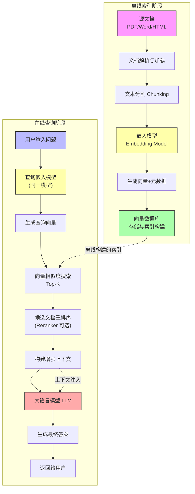
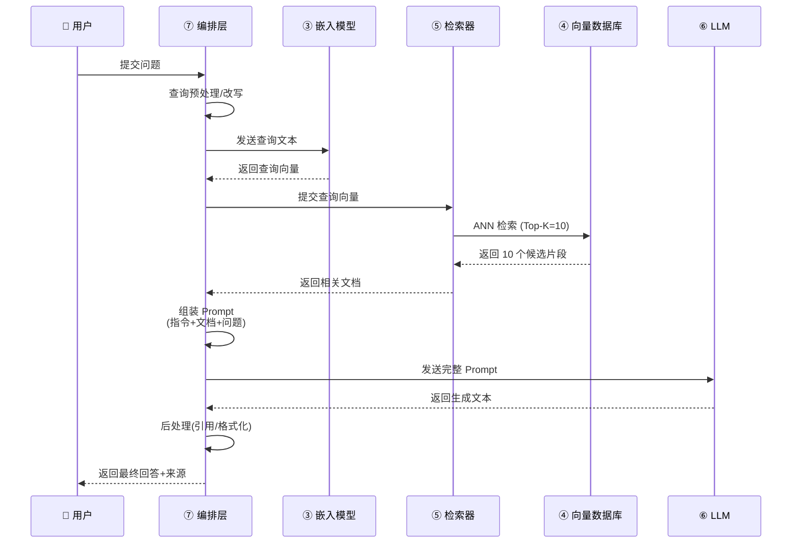
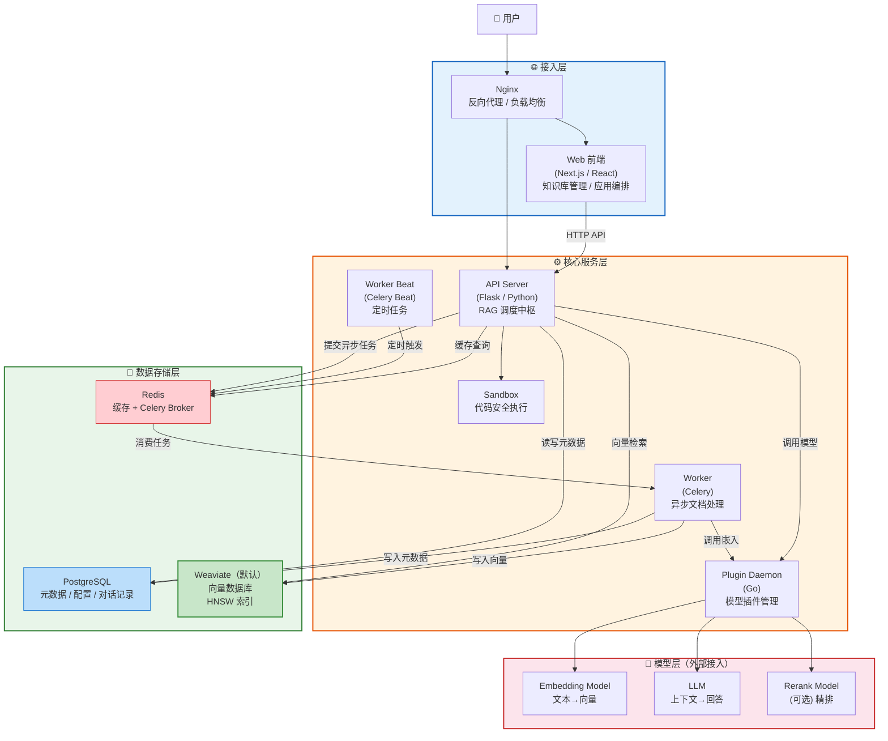
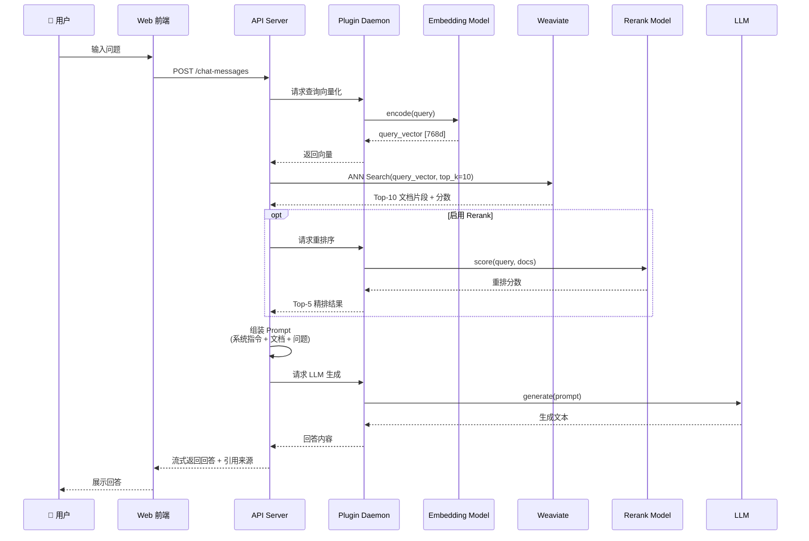
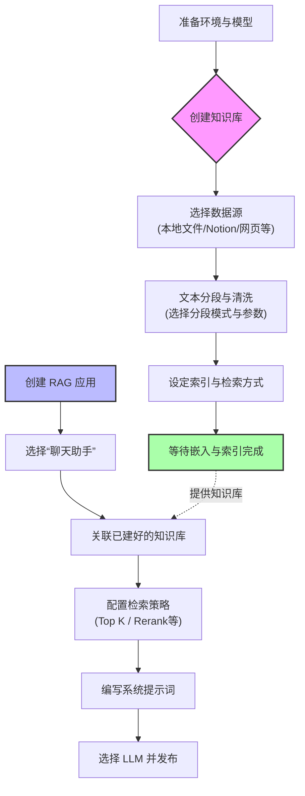

# RAG快速实践

RAG（Retrieval-Augmented Generation，检索增强生成） 是一种将外部知识检索与大语言模型生成能力相结合的架构范式。其核心思想是：在模型生成回答之前，先从外部知识库中检索与用户查询相关的上下文信息，将其注入到模型的提示词中，从而使模型能够基于最新、准确、领域专属的知识进行生成，有效缓解幻觉问题。

## RAG 整体架构概览

完整的 RAG 系统由离线数据处理管线（Offline Pipeline） 和在线查询管线（Online Pipeline） 两大部分组成。

1. 索引子系统（离线/后台）：负责将源文档转化为可检索的知识库。

2. 查询与生成子系统（在线/实时）：负责接收用户提问，检索相关文档，并生成最终回答。

整个流程可以概括为：文档切块 → 向量化 → 存储 → 查询向量化 → 相似度检索 → 上下文增强 → LLM生成。



图中关键组件说明：

- 黄色节点：嵌入模型，索引和查询共用同一模型，确保向量空间一致。
- 绿色节点：向量数据库，承载索引存储与检索能力。
- 红色节点：大语言模型，负责最终生成。
- 虚线箭头：表示索引构建结果被在线检索阶段使用；表示上下文注入到LLM。

### 索引阶段（离线构建）

离线管线负责将原始知识转化为可被高效检索的向量索引，是 RAG 系统质量的基础。

1. 文档加载（Document Loader）

   负责从各类数据源中抽取原始文本内容。支持的格式包括PDF、Word、Markdown、HTML、代码文件、数据库记录、网页爬虫数据、多模态文档（图表、扫描件）等。常用工具有LangChain Document Loaders、LlamaIndex Readers、Unstructured.io、Apache Tika。

2. 文本清洗与预处理（Cleaning）

   去除噪声，统一格式。具体做法主要包括去除多余空白/特殊字符、统一编码、修复OCR错误、提取元数据（标题、作者、日期）、语言检测等。

3. 文本分块（Chunking）

   将长文档切分为适合嵌入和检索的小片段，关键参数有chunk_size（通常256–1024 tokens）、chunk_overlap（10%–20%）两个。常用策略如下表：

   | 策略         | 说明                                       | 适用场景                 |
   | :----------- | :----------------------------------------- | :----------------------- |
   | 固定长度分块 | 按固定 token/字符数切分，带重叠（overlap） | 通用、快速实现           |
   | 递归字符分块 | 按段落→句子→字符层级递归切分               | 保持语义完整性           |
   | 语义分块     | 基于嵌入相似度变化点切分                   | 语义边界敏感场景         |
   | 文档结构分块 | 按标题/章节/表格结构切分                   | 结构化文档（法律、论文） |

4. 嵌入编码（Embedding）

   将每个文本块转换为稠密向量，常用模型有 Qwen3-Embedding、BGE-M3、text-embedding-3-large、Cohere Embed 等。可基于 vLLM（--task embed）部署或 基于Sentence-Transformers 进行批量编码。模型输出的每个 chunk 对应一个固定维度的浮点向量（如768维或1024维）。

5. 向量索引存储（Vector Store）

   持久化存储向量并提供高效的近似最近邻（ANN）检索，常用的向量数据库如下：

   | 数据库               | 特点                         |
   | :------------------- | :--------------------------- |
   | Milvus / Zilliz      | 分布式、高性能、支持混合检索 |
   | Pinecone             | 全托管、开箱即用             |
   | Weaviate             | 内置向量化、支持多模态       |
   | Qdrant               | Rust实现、低延迟             |
   | FAISS                | Meta开源、本地轻量           |
   | Chroma               | 轻量、适合原型开发           |
   | Elasticsearch (8.x+) | 传统ES + 向量混合            |

   

### 查询与生成阶段（在线实时）

在线管线是用户每次提问时的实时处理流程，决定了最终回答的质量。

1. 查询预处理与改写（Query Processing）

   - 查询改写（Query Rewriting）： 将口语化、模糊的查询改写为更适合检索的形式。
   - 查询扩展（Query Expansion）： 利用LLM生成多个同义/相关查询，多路召回后合并。
   - 查询分解（Query Decomposition）： 将复杂问题拆解为多个子问题，分别检索后综合。
   - 意图识别： 判断是否需要检索（如闲聊类问题可直接回答）。

2. 查询向量化（Query Embedding）

   使用与离线阶段相同的嵌入模型将查询编码为向量。需要注意的是，查询和文档应使用不同的 Prompt 模板（如查询加 Instruct: ... 前缀），以区分检索意图。

3. 向量相似度检索（Retrieval）

   在向量数据库中执行近似最近邻搜索，找出与查询向量在语义上最相似的Top-K个文本块（K通常为5~20）。

   - 算法： 余弦相似度、内积、L2距离。
   - 索引类型： HNSW（高召回、低延迟）、IVF_PQ（大规模、省内存）、Flat（精确但慢）。
   - 混合检索（Hybrid Search）： 向量语义检索 + BM25关键词检索，取并集或加权融合（RRF算法），兼顾语义匹配和精确匹配。
   - 输出： Top-K 个最相关的文档片段（通常 K=10~50）。

4. 重排序（Reranking）

   为进一步提升精度，可使用Reranker模型对Top-K结果进行重新排序，将最相关的文档排在更前面。常用模型有Qwen3-Reranker、bge-reranker-v2-m3、Cohere Rerank。它的基本逻辑是将 (query, document) 对输入交叉编码器（Cross-Encoder），输出相关性分数（精排后的 Top-N 文档（通常 N=3~8））。

5. 上下文构建

   将检索到的相关文本块（以及可能的元数据）按照一定格式（如“参考资料：……”）拼接成上下文提示词。

6. 提示词构建（Prompt Building）和LLM生成

   将用户原始问题与检索到的上下文拼接成一个完整的Prompt，发送给大语言模型（LLM）。下面是常用的提示词模板：

   ```
   你是一个专业的知识问答助手。请严格基于以下参考资料回答用户问题。
   
   ## 规则
   1. 只根据【参考资料】中的内容回答，不要编造信息
   2. 如果参考资料中没有相关信息，明确告知用户"根据现有资料，无法回答该问题"
   3. 回答时引用来源文档名称
   4. 使用清晰的结构化格式（列表、段落）组织回答
   5. 如果用户问题模糊，先确认用户意图再回答
   
   ## 参考资料
   {{#context#}}
   
   ## 用户问题
   {{#query#}}
   ```
   
7. 输出解析与后处理（Post-Processing）

   - 来源引用： 提取回答中引用的文档编号，附加原文链接。
   - 格式化： Markdown 渲染、表格提取、代码高亮。
   - 安全过滤： 敏感信息脱敏、合规检查。
   - 幻觉检测： 对比生成内容与检索文档的一致性（NLI模型）。


## RAG 系统最小必要组件

部署一个可运行的 RAG 系统，至少需要以下 7 个核心组件：

| 序号 | 组件             | 职责                              | 典型实现                                             |
| :--: | :--------------- | :-------------------------------- | :--------------------------------------------------- |
|  ①   | 数据源           | 提供领域知识的原始载体            | PDF、网页、Markdown文件、数据库表、API接口、代码仓库 |
|  ②   | 文档解析与分块器 | 将原始文档转为可检索的文本片段    | LangChain Splitter、Unstructured                     |
|  ③   | 嵌入模型         | 将文本编码为稠密向量              | Qwen3-Embedding、BGE、text-embedding-3               |
|  ④   | 向量数据库       | 存储向量并提供相似度检索          | Milvus、FAISS、Chroma、Qdrant                        |
|  ⑤   | 检索器           | 执行查询→向量的匹配，返回相关片段 | ANN 搜索 + 可选 BM25                                 |
|  ⑥   | 大语言模型       | 基于检索到的上下文生成最终回答    | Qwen3、GPT-4o、LLaMA                                 |
|  ⑦   | 应用编排层       | 串联所有组件、管理用户交互        | LangChain、LlamaIndex、自研服务                      |

### 职责说明

1. 数据源（Data Source）

   原始知识来源，载体可以是PDF文档、HTML网页、Markdown文件、数据库表、API接口、代码仓库、音视频转写文本等。数据质量直接决定 RAG 回答的上限，务必要确保数据准确、时效、无冗余。

2. 文档解析与分块器（Parser & Splitter）

   负责将非结构化文档转为结构化文本片段，提取正文、去除页眉页脚、识别表格和列表、保留元数据。分块太大会导致检索精度低，但分块太小又会造成上下文丢失。常用分块策略：

3. 嵌入模型（Embedding Model）

    将文本映射到高维稠密向量空间，使语义相近的文本在空间中距离更近。离线和在线必须使用完全相同的模型和版本。

4. 向量数据库（Vector Store）

   持久化存储向量，并提供高效的近似最近邻检索，提供的核心能力包括：

   - 写入：接收向量 + 原文 + 元数据
   - 索引：构建 HNSW / IVF / PQ 等索引结构
   - 查询：给定查询向量，返回 Top-K 最相似结果

   选型时，需要重点考虑数据规模、查询延迟、是否支持混合检索（向量+关键词）和运维复杂度。

5. 检索器（Retriever）

   执行从"查询向量"到"相关文档"的映射逻辑，基础模式是纯向量检索（余弦相似度 / 内积），增强模式还包括：

   - 混合检索：向量 + BM25 关键词，RRF 融合
   - 多路召回：多个嵌入模型或多种索引并行
   - 元数据过滤：按时间、来源、标签预筛选

6. 大语言模型（LLM）

   基于检索到的上下文，生成准确、连贯、有据可依的最终回答，输入的是结构化 Prompt （系统指令 + 检索到的文档片段 + 用户问题 + 输出约束），相关的关键配置包括temperature=0~0.3（保证事实性）、max_tokens和top_p。

7. 应用编排层（Orchestrator）

   整个系统的"大脑"和"调度中心"，常见实现有LangChain、Langflow、LlamaIndex、Haystack、Dify、FastGPT、MaxKB、AnythingLLM，或者是自研的实现等，其功能包括：

   - 接收用户请求，触发完整流水线
   - 管理组件间的调用顺序和数据传递
   - 错误处理、超时重试、并发控制
   - 查询改写、结果后处理、来源引用标注
   - 日志记录、监控埋点

上面这 7 个核心组件缺一不可：缺少任何一个，系统无法完成从"知识存储"到"知识问答"的闭环。最小可行 RAG 的"7+1"公式：

```
最小可行 RAG = 数据源 + 解析分块 + 嵌入模型 + 向量库 + 检索器 + LLM + 编排层
              \________________________/   \________________________/
                   离线：建库（一次）          在线：问答（每次）
```

其它可选的增强手段：加入 Reranker 可提升 Top-N 精度 10%~30%；加入查询改写可提升召回率；加入语义缓存可降低重复查询延迟。

### 请求的交互时序




## 基于Dify的RAG

 Dify（早期发音 /ˈdɪfaɪ/，取自 "Define + Modify"，2025年5月左右改为读音/ˈdɪfiː/，中文谐音“迪-菲”）是一个开源的 LLM 应用开发平台，由 LangGenius 团队于 2023 年创建并持续维护，其 RAG（检索增强生成）系统是整个平台的核心能力之一。Dify 1.7 的 RAG 系统遵循 三阶段 ETL（Extract-Transform-Load）流程进行文档处理，并结合多模式检索机制实现知识访问。

> Dify 不是大模型，也不是单纯的聊天机器人框架，而是一个完整的 AI 应用工程化平台——覆盖从 Prompt 编排、RAG 管线、Agent 框架到应用发布、监控评估的全生命周期。

Dify有六大核心功能：

- AI 应用编排：聊天助手（支持多轮对话、记忆管理）、文本生成（单次输入输出）、Agent、Workflow、Chatflow（workflow+对话能力综合体）
- RAG引擎：支持完整的ETL 管线（Extract → Transform → Load）
- 模型供应商管理：通过 Plugin Daemon 统一管理所有模型调用，支持 100+ 模型，包括OpenAI-API-compatible，支持负载均衡和Fallback（多 Key 轮询、自动故障切换）
- 工具与插件生态：有内置工具（网页搜索等），支持自定义工具（OpenAPI/Swagger 导入、代码工具），内置插件市场，支持MCP
- 可观测性与评估：可记录每次调用的完整链路（Prompt → 检索 → LLM → 输出），支持标与反馈（收集用户对回答点赞/点踩，用于持续优化），支持Token用量统计和A/B测试
- 多渠道发布：Web App、API接口（RESTful）、嵌入式 Widget（iframe / JS SDK），也支持与微信服务号 / 企业微信 / 飞书 / Slack / Discord 集成

Dify的典型应用场景：

| 场景           | 说明                                              |
| :------------- | :------------------------------------------------ |
| 企业内部知识库 | 规章制度、技术文档、FAQ 的智能问答                |
| 客户服务机器人 | 接入产品文档 + 工单系统，自动解答用户问题         |
| 数据分析助手   | Text-to-SQL + 图表生成，自然语言查数据            |
| 内容创作工作台 | 写作辅助、翻译、摘要、SEO 优化                    |
| 代码助手       | 基于内部代码库的补全、解释、Review                |
| 教育培训       | 课件问答、自适应学习、作业批改                    |
| 法律/医疗咨询  | 基于专业法规/指南的合规问答                       |
| 多 Agent 协作  | 研究 Agent + 写作 Agent + 审核 Agent 协同完成任务 |

通过 Docker Compose 部署时，Dify 1.7 会启动 7 个核心服务 + 8 个依赖组件，共同支撑 RAG 系统的完整运行。

### Dify的关键组件




核心服务层：

| 组件          | 技术栈          | 在 RAG 中的作用                                              |
| :------------ | :-------------- | :----------------------------------------------------------- |
| API Server    | Flask (Python)  | RAG 的核心调度中枢：接收文档上传、触发 ETL 管线、执行检索逻辑、组装 Prompt、调用 LLM |
| Worker        | Celery Worker   | 异步处理文档解析、分块、向量化等耗时任务，避免阻塞 API       |
| Worker Beat   | Celery Beat     | 定时任务调度：知识库定期同步、索引重建、过期清理             |
| Web           | Next.js (React) | 提供知识库管理界面：文档上传、分段预览、检索测试、应用编排   |
| Plugin Daemon | Go              | 管理外部模型插件：嵌入模型、Rerank 模型、LLM 的统一接入层    |
| Sandbox       | DifySandbox     | 安全隔离环境，执行工作流中的代码节点（如自定义分块脚本）     |
| Nginx         | Nginx           | 反向代理，统一入口，路由前端/后端请求                        |

数据存储层：

| 组件             | 技术栈         | 在 RAG 中的作用                                              |
| :--------------- | :------------- | :----------------------------------------------------------- |
| PostgreSQL       | PostgreSQL 15+ | 存储结构化元数据：知识库配置、文档记录、分段索引、用户/应用/对话数据 |
| Weaviate（默认） | Weaviate       | 向量数据库：存储文本块的嵌入向量，提供 ANN 近似最近邻检索    |
| Redis            | Redis 7+       | 缓存层 + 消息队列：缓存热点查询结果、作为 Celery 的 Broker 传递异步任务 |

模型层（外部接入）：

| 组件                 | 说明                                               | 在 RAG 中的作用                     |
| :------------------- | :------------------------------------------------- | :---------------------------------- |
| Embedding Model      | 如 text-embedding-3-small、BGE-M3、Qwen3-Embedding | 将文本块和查询编码为稠密向量        |
| LLM                  | 如 GPT-4o、Qwen3、DeepSeek                         | 基于检索上下文生成最终回答          |
| Rerank Model（可选） | 如 bge-reranker、Cohere Rerank                     | 对粗排结果进行精排，提升 Top-N 精度 |

### 各组件的作用

```
┌─────────────────────────────────────────────────────────────────┐
│                        Dify 1.7 RAG 系统                        │
├─────────────────────────────────────────────────────────────────┤
│                                                                 │
│  用户 ──→ Nginx ──→ Web (管理界面)                              │
│                  └──→ API Server (调度中枢)                     │
│                         │                                       │
│            ┌────────────┼────────────────┐                      │
│            ▼            ▼                ▼                      │
│      PostgreSQL    Weaviate         Plugin Daemon               │
│     (元数据)      (向量检索)       (模型路由)                    │
│            │            │           ┌───┼───┐                   │
│            │            │           ▼   ▼   ▼                   │
│            │            │       Embed  LLM  Rerank              │
│            │            │                                       │
│            └─────┬──────┘                                       │
│                  │                                              │
│                  ▼                                              │
│         Redis ←→ Worker (Celery)                                │
│        (队列)    (异步文档处理)                                   │
│                                                                 │
└─────────────────────────────────────────────────────────────────┘
```


1. API Server（核心调度）：系统的大脑，RAG相关的功能包括
   - 接收用户上传的文档（PDF、Word、Markdown、HTML、TXT 等）
   - 调用文档解析器提取纯文本
   - 触发文本分块（Chunking）
   - 调用嵌入模型进行向量化
   - 将向量写入 Weaviate
   - 接收用户查询，执行检索（向量/全文/混合）
   - 组装 Prompt，调用 LLM 生成回答
   - 管理对话历史、引用来源
2. Worker（异步任务引擎）：处理所有耗时的后台任务，RAG相关的功能包括：
   - 文档解析（PDF 提取、OCR、表格识别）
   - 文本清洗与预处理
   - 批量分块与向量化编码
   - 向量写入向量数据库
   - 知识库增量更新与重建
3. PostgreSQL（元数据存储）：存储所有结构化数据，RAG功能相关的数据有
   - 知识库定义（名称、描述、配置参数）
   - 文档记录（文件名、大小、状态、上传时间）
   - 分段索引（每个 chunk 的 ID、位置、长度、关键词）
   - 用户、应用、对话、消息记录
   - 模型供应商配置
4. Weaviate（向量数据库）：存储向量并提供高效的相似度检索，可按需要替换为其它实现（Milvus、Qdrant、PGVector等）。核心能力如下
   - 存储每个文本块的嵌入向量（如 768 维或 1536 维）
   - 支持 HNSW 索引，实现毫秒级 ANN 检索
   - 支持混合检索（向量 + BM25 全文）
   - 支持元数据过滤
5. Redis（缓存与消息队列）：双重角色
   - 消息队列（Broker）： Celery Worker 的任务分发通道，API 将文档处理任务推入 Redis，Worker 从中消费
   - 缓存： 缓存模型调用结果、会话状态、速率限制计数
6. 嵌入模型（Embedding Model）：将文本映射为语义向量，Dify 本身不内置嵌入模型，需用户在"模型供应商"中配置
7. LLM（大语言模型）：用户在应用中指定要选用的模型，在RAG中基于检索到的上下文生成最终回答
8. Rerank Model（可选）：对检索粗排结果进行二次精排

各组件的默认配置与可替换选项：

| 组件       | Dify 1.7 默认      | 可替换选项                                                   |
| :--------- | :----------------- | :----------------------------------------------------------- |
| 向量数据库 | Weaviate           | Milvus、Qdrant、PGVector、Chroma、TiDB Vector、Elasticsearch、OpenSearch |
| 关系数据库 | PostgreSQL         | 不可替换（强依赖）                                           |
| 缓存/队列  | Redis              | 不可替换（Celery 强依赖）                                    |
| 嵌入模型   | 无内置，需用户配置 | OpenAI、BGE、Qwen3-Embedding、Cohere 等                      |
| LLM        | 无内置，需用户配置 | GPT-4o、Qwen3、DeepSeek、Claude、LLaMA 等                    |
| Rerank     | 可选，默认关闭     | bge-reranker、Cohere Rerank、Jina Rerank                     |

### 各组件的交互流程



## 部署和启动Dify

我们这里以 Docker Compose 社区版（推荐方式）为主线，覆盖从环境准备到首次登录的全流程。

### 前置要求

硬件最低配置：

| 资源 | 最低要求                       | 推荐配置   |
| :--- | :----------------------------- | :--------- |
| CPU  | 2 核                           | 4 核+      |
| 内存 | 4 GB                           | 8 GB+      |
| 磁盘 | 20 GB                          | 50 GB+ SSD |
| 网络 | 可访问外网（拉取镜像/模型API） | 稳定带宽   |

安装依赖的程序包：

```bash
# 必须安装
Docker        >= 24.0
Docker Compose >= 2.20

# 验证版本
docker --version          # 确认 >= 24.0
docker compose version    # 确认 >= 2.20（注意是 v2 插件模式）
```

用到的端口：

| 端口 | 服务            | 说明                            |
| :--- | :-------------- | :------------------------------ |
| 80   | Nginx           | HTTP 入口（默认）               |
| 443  | Nginx           | HTTPS 入口（可选）              |
| 3000 | Next.js Console | 前端（内部，经 Nginx 代理）     |
| 5001 | API Server      | 后端 API（内部，经 Nginx 代理） |
| 6379 | Redis           | 内部使用                        |
| 5432 | PostgreSQL      | 内部使用                        |
| 8080 | Weaviate        | 内部使用                        |

> 请务必确保 80 端口未被占用。如需修改，请编辑环境变量配置文件中 .env 中的 NGINX_PORT。

### 部署步骤

1. 克隆仓库

   ```bash
   git clone https://github.com/langgenius/dify.git
   cd dify/docker
   ```

2. 配置环境变量

   ```bash 
   # 复制示例配置，实验环境执行该步骤即可，无须再进行任何修改
   cp .env.example .env
   ```

   关键配置项说明（按需修改）：

   ```
   # ===== 基础配置 =====
   # 对外暴露端口（默认80，改为其他端口避免冲突）
   NGINX_PORT=80
   
   # 密钥（务必修改！用于加密敏感数据）
   SECRET_KEY=sk-xxxxxxxxxxxxxxxxxxxx
   # 生成随机密钥：openssl rand -base64 42
   
   # ===== 数据库配置 =====
   DB_USERNAME=dify
   DB_PASSWORD=difyai123456      # 生产环境务必修改
   DB_HOST=db
   DB_PORT=5432
   DB_DATABASE=dify
   
   # ===== Redis 配置 =====
   REDIS_HOST=redis
   REDIS_PORT=6379
   REDIS_PASSWORD=difyai123456   # 生产环境务必修改
   
   # ===== 向量数据库（默认 Weaviate）=====
   VECTOR_STORE=weaviate
   WEAVIATE_ENDPOINT=http://weaviate:8080
   WEAVIATE_API_KEY=WVF5YThaHlkYwhGUSmCRgsX3tD5ngdN8pkih
   
   # ===== 对象存储（默认 MinIO）=====
   STORAGE_TYPE=minio
   MINIO_ENDPOINT=minio
   MINIO_PORT=9000
   MINIO_ACCESS_KEY=minioadmin
   MINIO_SECRET_KEY=minioadmin   # 生产环境务必修改
   MINIO_BUCKET=dify
   
   # ===== 沙箱配置 =====
   SANDBOX_API_KEY=dify-sandbox
   CODE_EXECUTION_ENDPOINT=http://sandbox:8194
   
   # ===== 其他 =====
   CONSOLE_WEB_URL=http://localhost     # 前端地址（改为可用的域名/IP）
   SERVICE_API_URL=http://localhost     # API 地址
   APP_WEB_URL=http://localhost         # Web App 地址
   LOG_LEVEL=INFO                       # 日志级别：DEBUG/INFO/WARNING/ERROR
   ```

   

3. 启动服务

   ```bash
   # 拉取镜像并启动所有服务（首次约需 3-10 分钟）
   docker compose up -d
   ```

   

4. 初始化管理员账号

   首次访问时，浏览器会自动跳转至安装页面（/install），按需填入管理信息后即可。

   

## 构建基于RAG的聊天应用




### 基础环境准备

配置模型供应商：在 Dify 的 “设置” -> “模型供应商” 页面，配置并添加可用的 API 密钥。

- 必须配置：文本嵌入模型（TEXT EMBEDDING），它是将文本转换为向量的基础。
- 强烈推荐配置：重排序模型（RERANK），用于对检索结果进行二次排序，能显著提升最终答案的精度。
- 应用层使用：大语言模型（LLM），用于基于检索到的上下文生成回答。

需要注意的是，嵌入模型的选择至关重要，因为一旦选定并索引文档后更换模型，需要重新索引所有文档。

### 创建知识库

知识库是 RAG 应用的“外挂大脑”，负责存储和管理你的私有数据。以下配置步骤：

1. 进入知识库模块：登录 Dify 控制台，在左侧菜单栏点击 “知识库”。

2. 创建新知识库：点击 “创建知识库”。

3. 选择数据源：Dify 支持多种数据来源：
   - 本地文件：上传本地的 PDF, DOCX, TXT, Markdown, HTML 等文件。支持拖拽或批量上传，单次最多50个文件，单个文件不超过15MB。
   - 在线数据：同步 Notion 工作区、网页爬虫（支持 Jina Reader 和 Firecrawl）等。

4. 文本分段与清洗（关键环节）：这是决定检索质量的关键步骤。Dify 提供了三种分段模式：
   - 通用分段：最常用模式，文本被均匀切分成指定长度的块。

     | 参数     | 说明                           | 推荐值           |
     | :------- | :----------------------------- | :--------------- |
     | 分段标识 | 文本切分的依据字符             | `\n\n`（双换行） |
     | 最大长度 | 每个 chunk 的最大 token 数     | 500~1000         |
     | 重叠长度 | 相邻 chunk 之间重叠的 token 数 | 50~100           |

     > 经验法则：
     >
     > - 技术文档/手册：500~800 tokens，重叠 100
     > - FAQ/问答对：按 \n\n 自然分割，长度 300~500
     > - 法律/合同：800~1500，保留完整条款
     > - 代码文档：按函数/类切分

   - Q&A 分段：AI 自动从文档中提取问答对，适合 FAQ 或客服知识库。

   - 父子分段：高级策略。使用较小的子块进行精确检索，但返回包含更多上下文的父块，兼顾精度和上下文完整性。

     | 设置           | 说明                                      |
     | :------------- | :---------------------------------------- |
     | 子分段最大长度 | 用于检索的小片段（如 200 tokens）         |
     | 父分段最大长度 | 返回给 LLM 的完整上下文（如 2000 tokens） |

     > 适用场景：文档结构复杂，需要精准定位但完整上下文的情况。

5. 设置索引和检索方法：

   - 索引方式：定义如何为文本块创建向量索引。

     | 索引方式           | 原理                   | 适用场景                 |
     | :----------------- | :--------------------- | :----------------------- |
     | 高质量索引（推荐） | Embedding 模型向量化   | 需要语义检索、混合检索   |
     | 经济索引           | 关键词倒排索引（BM25） | 预算有限、仅需关键词匹配 |

   - 检索设置：知识库接收到用户查询后，按预设方式检索内容。Dify 支持向量检索、全文检索和混合检索（推荐）。

     | 参数        | 说明                       | 推荐值           |
     | :---------- | :------------------------- | :--------------- |
     | 检索模式    | 语义/全文/混合             | 混合检索         |
     | Top-K       | 返回最相关的 K 个片段      | 5~8              |
     | Score 阈值  | 相似度低于此值的结果被过滤 | 0.5~0.7          |
     | Rerank 模型 | 对召回结果二次排序         | 启用（如已配置） |

6. 等待嵌入完成：系统将自动调用配置的嵌入模型，将文本块向量化并存入向量数据库。需要确认状态从 "等待中" → "解析中" → "已完成"。

   - 小文档（<10页）：约 1~3 分钟
   - 大文档（>50页）：可能需要 5~15 分钟

7. 验证知识库（召回测试）

   在知识库详情页，点击 “召回测试”：

   （1）输入一个测试问题（如 "Pod为什么会反复重启？"）

   （2）查看返回的文档片段列表

   （3）检查：相关内容是否被召回？排序是否合理？片段长度是否包含足够上下文？

   （4）如效果不佳，调整分段策略或检索参数后重新测试

> 高级功能 - 知识流水线 (Knowledge Pipeline)：在 Dify 企业版中，可以通过可视化的方式拖拽和连接不同节点（如文档提取器、分块器），来定制化地构建数据处理流程。

### 创建并配置 RAG 应用

知识库创建好后，就可以将其集成到应用中，实现基于私有数据的问答。

1. 新建应用：在 “工作室” 页面，点击 “创建空白应用”，选择 “聊天助手” 类型。

   | 应用类型             | 适用场景                   |
   | :------------------- | :------------------------- |
   | 聊天助手（推荐入门） | 多轮对话式问答             |
   | Chatflow             | 复杂对话流程（带条件分支） |
   | Workflow             | 单次任务型（无对话记忆）   |

2. 关联知识库：进入应用编排页面，在上下文（Context）或知识库检索节点中，添加第二步创建好的知识库。可选择多个知识，且能够设置每个知识库的参数参数（会覆盖知识库的默认值）。

3. 配置检索策略：在应用的知识库节点中，可以进一步设置检索参数：
   - Top K：返回最相关的文档片段数量。
   - Score Threshold：设置相似度阈值，低于此分数的结果将被过滤。
   - Rerank 模型：如果已配置，可在此启用重排序模型对结果进行精排。

4. 编写系统提示词：在“指令”或“系统提示词”框中，指导 LLM 如何基于检索到的知识回答问题。这是 决定回答质量的核心。推荐模板：

   ```
   你是一个专业的知识问答助手。请严格基于以下参考资料回答用户问题。
   
   ## 规则
   1. 只根据【参考资料】中的内容回答，不要编造信息
   2. 如果参考资料中没有相关信息，明确告知用户"根据现有资料，无法回答该问题"
   3. 回答时引用来源文档名称
   4. 使用清晰的结构化格式（列表、段落）组织回答
   5. 如果用户问题模糊，先确认用户意图再回答
   
   ## 参考资料
   {{#context#}}
   
   ## 用户问题
   {{#query#}}
   ```

   > {{#context#}} 是 Dify 的内置变量，会自动注入检索到的文档片段。

5. 选择模型，下表是选择模型时可参考的参数配置：

   | 参数             | 推荐值    | 说明                           |
   | :--------------- | :-------- | :----------------------------- |
   | Temperature      | 0.1 ~ 0.3 | RAG 场景需要事实性，降低随机性 |
   | Top-P            | 0.9       | 保持适度多样性                 |
   | Max Tokens       | 2048      | 根据回答长度需求调整           |
   | Presence Penalty | 0         | 通常不需要                     |

6. 预览测试：在应用编排页面右侧的 预览窗口 中输入测试问题并观察：

   - 回答是否基于检索到的文档？
   - 是否有幻觉（编造信息）？
   - 引用来源是否正确？
   - 响应速度是否可接受？

   回答下方的 “引用” 中可查看具体召回的文档片段。

7. 批量测试

   （1）准备测试集（20~50 个典型问题 + 标准答案）

   （2）在 “日志与标注”中逐条检查回答质量

   （3）使用 “标注回复”」功能纠正错误回答

   （4）计算准确率，迭代优化

8. 发布上线点击 “发布”后即可在 Dify 的“概览”页面或通过公开 URL 来测试发布的 RAG 应用。

### 高级配置与优化

1. 检索策略调优

   ```
   ┌─────────────────────────────────────────────┐
   │           检索策略配置面板                    │
   ├─────────────────────────────────────────────┤
   │ 检索模式：  ○ 语义检索  ○ 全文检索  ● 混合检索   │
   │ Top-K：     [  5  ]                         │
   │ Score阈值： [ 0.5 ]  ☑ 启用                  │
   │ Rerank：    ☑ 启用  模型: bge-reranker-v2-m3 │
   │ 重排后Top-N：[  3  ]                         │
   └─────────────────────────────────────────────┘
   ```

   三种检索模式对比：

   | 模式     | 优势                  | 劣势               | 适用场景           |
   | :------- | :-------------------- | :----------------- | :----------------- |
   | 语义检索 | 理解同义词/改述       | 可能遗漏精确关键词 | 日常问答、概念解释 |
   | 全文检索 | 精确匹配专有名词/编号 | 不理解语义         | 术语查询、编号查询 |
   | 混合检索 | 兼顾两者优势          | 计算量稍大         | 大多数场景首选     |

2. 对话记忆设置

   | 设置       | 说明                       | 推荐      |
   | :--------- | :------------------------- | :-------- |
   | 对话轮次   | 携带几轮历史对话作为上下文 | 3~5 轮    |
   | 上下文窗口 | 最大 token 限制            | 4000~8000 |

3. 功能增强开关

   | 功能           | 作用                     | 建议         |
   | :------------- | :----------------------- | :----------- |
   | 引用归属       | 回答中标注来源文档和段落 | 开启         |
   | 敏感词审核     | 过滤不当内容             | 按需开启     |
   | 标注回复       | 人工标注优化回答         | 运营阶段开启 |
   | 开场白         | 首次对话的欢迎语         | 配置         |
   | 下一步问题建议 | 自动推荐后续问题         | 开启         |

4. 使用 Chatflow 构建复杂 RAG（进阶）

   对于需要 意图识别、多知识库路由、条件判断 的场景，使用 Chatflow：

   ```mermaid
   flowchart TD
       START["🟢 开始<br/>用户输入"] --> CLASSIFY["🔀 问题分类<br/>LLM节点"]
       
       CLASSIFY -->|"产品问题"| KB_PRODUCT["📚 知识检索<br/>产品知识库"]
       CLASSIFY -->|"HR问题"| KB_HR["📚 知识检索<br/>SRE知识库"]
       CLASSIFY -->|"其他/闲聊"| DIRECT["💬 LLM<br/>直接回答"]
       
       KB_PRODUCT --> LLM1["🤖 LLM 生成<br/>基于产品文档回答"]
       KB_HR --> LLM2["🤖 LLM 生成<br/>基于SRE文档回答"]
       
       LLM1 --> END["🔴 结束<br/>输出回答"]
       LLM2 --> END
       DIRECT --> END
   
       style START fill:#c8e6c9,stroke:#2E7D32
       style END fill:#ffcdd2,stroke:#C62828
       style CLASSIFY fill:#fff9c4,stroke:#F57F17
   ```

   Chatflow 节点说明：

   - 问题分类节点： 使用 LLM 判断用户意图，路由到不同分支
   - 知识检索节点： 每个分支连接不同的知识库
   - 条件分支： 根据检索结果是否为空，决定回答策略
   - 代码节点： 自定义后处理逻辑（如格式化、脱敏）

5. 常见优化策略

   | 问题       | 原因                  | 解决方案                                 |
   | :--------- | :-------------------- | :--------------------------------------- |
   | 回答不相关 | 检索未命中正确片段    | 调整分块大小；启用混合检索；增加 Top-K   |
   | 回答不完整 | 片段太短，上下文丢失  | 增大分块长度；启用父子分段               |
   | 出现幻觉   | LLM 未被约束          | 强化 Prompt 约束；降低 Temperature       |
   | 响应太慢   | 模型推理慢 / 检索量大 | 换更快的模型；减少 Top-K；启用缓存       |
   | 检索不到   | 关键词不匹配          | 启用混合检索；检查文档是否已索引完成     |
   | 回答太笼统 | 检索片段太多太杂      | 启用 Rerank；提高 Score 阈值；减少 Top-K |

## 版权声明

本文档由[马哥教育](www.magedu.com)开发，允许自由转载，但必须保留马哥教育及相关的一切标识。另外，商用需要征得马哥教育的书面同意。
