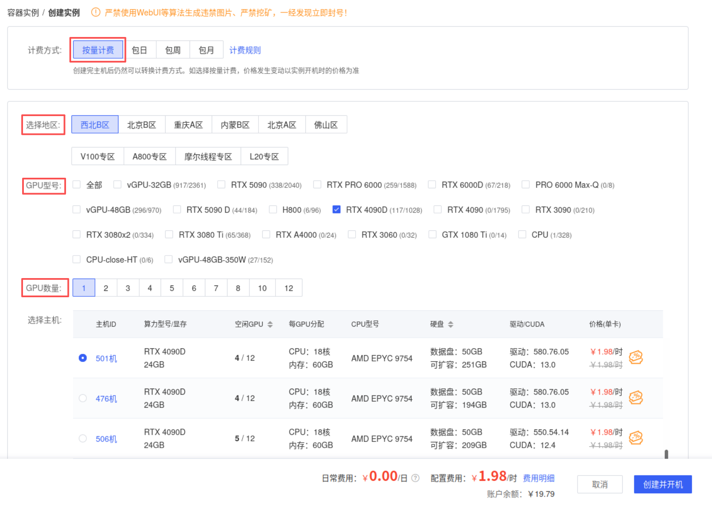
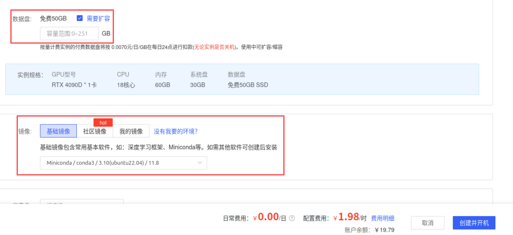
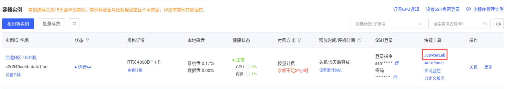
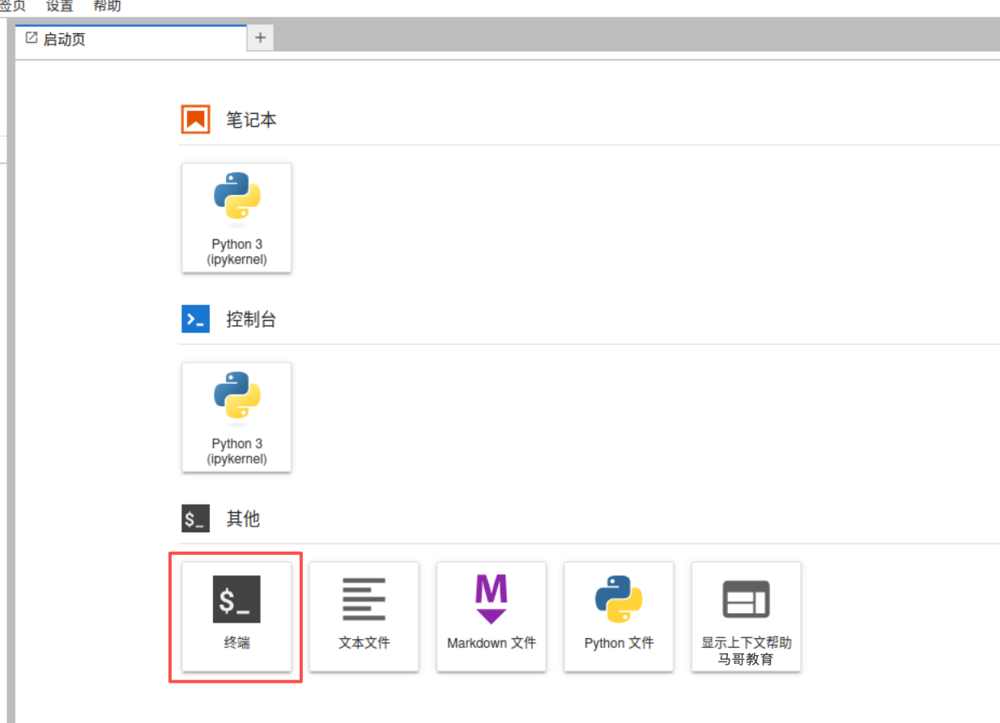
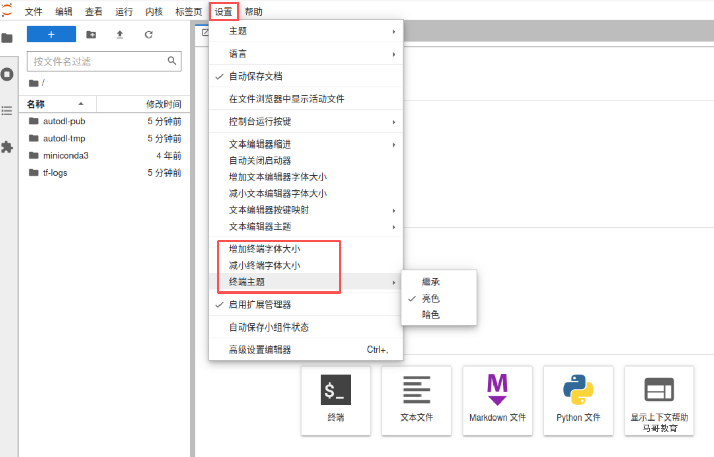
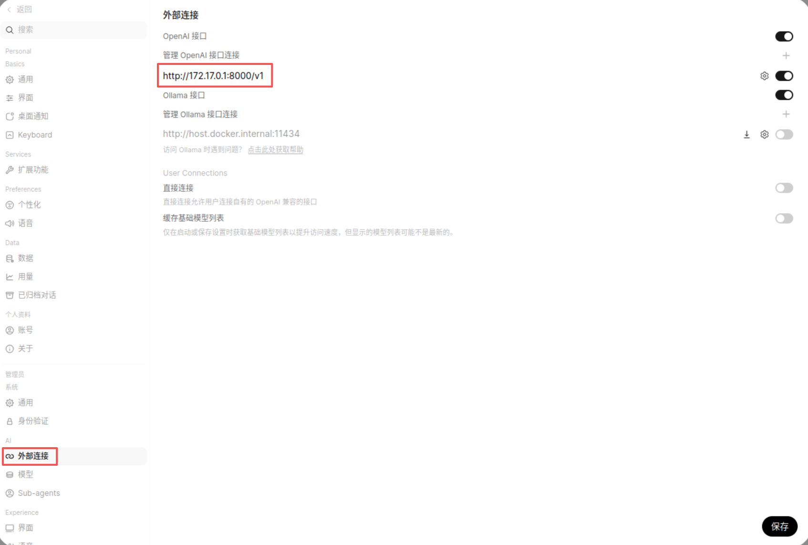

# 大模型实验手册

> 本实验手册基于AutoDL(http://autodl.com)进行。

> 最近一次修订时间：2026年8月28号。

**实验目标：**

- 在AutoDL上租用GPU实例，部署基于vLLM的Qwen私有模型； 
- 部署Open WebUI，接入前面部署的私有化Qwen模型；
- 使用Prometheus监控部署的私有化Qwen模型，并通过Grafana面板进行展示；


## 一、部署私有化模型

首先，注册账号、充值，并开始创建GPU实例。

### 1.1 创建GPU实例

在AutoDL上开始“创建实例”，选择计费方式、地区、GPU型号和GPU数量。

> 需要注意的是，创建实例时，若使用消费级的GPU，建议选择型号略新一些的，以免它能够支持的驱动和CUDA版本较老，无法运行较新版本的模型。例如，若要运行Qwen3.5及以上的版本，建议使用RTX 4090或RTX 5090。

接着，按需要选择扩充的数据盘空间。需要注意，扩展的空间要小于等于选择的目标主机上可分配的磁盘空间。



以上选择完成后，点击“创建并开机”即可。接下来即可通过JupterLab面板访问实例。



选择“终端”即可接入已经创建的GPU实例，如下图所示。



如有必要，可先按需调整终端主题和终端字体大小。调整的位置“设置”菜单栏中。



随后即可在终端中完成后续任务。

### 1.2 安装vLLM

安装vLLM时，通常使用隔离的Python环境进行。我们这里选用Miniconda。

> **Conda** 不仅是 Python 虚拟环境工具，它更是一个**通用的包管理系统和环境管理系统**。主要用于**解决项目间的依赖冲突**（比如项目A需要Python 3.9，项目B需要Python 3.12）。它有两个发行版：
>
> - **Anaconda**：大而全，预装了 1500+ 数据科学常用库，占用空间大（约 3-5 GB），适合不想折腾的初学者。
> - **Miniconda**：小而精，只包含 Python 和 Conda 核心，需按需手动安装包（`conda install`），推荐日常开发使用。

#### 1.2.1 Conda的基础用法

首先，确保已经安装了 Miniconda。可以打开终端（Terminal）或命令提示符，输入以下命令来验证是否安装成功并查看版本信息：

```bash
conda info
```

**1. 创建新的虚拟环境**

这是最关键的一步。使用 `conda create` 命令可以创建一个全新的、独立的“沙盒”环境。

- 基础创建：创建一个名为 `myenv` 的新环境

  ```bash
  conda create --name myenv       # --name 也可写作 -n
  ```

- **指定 Python 版本（推荐）**：在创建环境的同时指定 Python 版本，这是最佳实践

  ```bash
  conda create -n myenv python=3.12
  ```

- **指定 Python 版本和多个包**：一次性安装好项目所需的包，可以避免后续的依赖冲突

  ```bash
  conda create -n myenv python=3.12 numpy pandas scipy=1.7.3
  ```

- **指定环境位置**：默认情况下，环境会创建在 `~/anaconda3/envs/` 目录下。你也可以使用 `--prefix` 参数将其创建在项目文件夹内，使项目更具独立性

  ```bash
  conda create --prefix /path/to/your/project/env python=3.12    # --prefix 也可写作 -p
  ```

**2. 激活与退出环境**

环境创建后，需要“激活”才能进入并使用它。

- **激活环境**

  ```bash
  conda activate myenv
  ```

- **退出环境**：完成工作，需要回到系统基础环境时，即可选择退出

  ```bash
  conda deactivate
  ```

**3. 管理环境中的包**

进入（激活）环境后，你就可以使用 `conda` 或 `pip` 来安装、卸载、更新包了，二者可以混用。一个实践的原则是，尽量先 Conda 安装基础环境，再用pip安装Python的项目依赖。

- **使用pip安装包**：

  ```bash
  # 安装包
  pip install <package_name>
  
  # 指定版本
  pip install <package_name>==<version>
  
  # 从指定的文件安装包
  pip install -r requirements.txt
  
  # 升级包
  pip install --upgrade <package_name>
  ```

- **使用conda安装包**

  ```bash
  # 安装包，可以一次安装多个
  conda install <package_name> ...
  
  # 指定版本，一个等于号 = 即可
  conda install <package_name>=<version>
  ```

- **卸载包**：

  ```bash
  conda remove <package_name>
  # 或
  pip uninstall <package_name>
  ```

- **查看已安装的包**：

  ```bash
  # 列出已经安装的包
  conda list
  # 或
  pip list
  
  # 查看某个包的信息
  conda list <package_name>
  # 或
  pip show <package_name>
  ```

- **删除整个环境**

  这就是 Conda 最大的价值之一：项目环境出问题了，整个删掉重新建即可，不污染系统。

  ```bash
  # 先退出环境
  conda deactivate
  
  # 而后删除即可
  conda env remove -n myenv
  ```

  

#### 1.2.2 在Conda环境中安装vLLM

vLLM 是一个包含预编译 C++ 和 CUDA 内核的复杂库，官方**强烈推荐**在全新的 Conda 环境中使用 `pip` 进行安装。

**步骤 1：创建并激活Conda环境**

首先，创建干净的环境并指定Python版本。根据vLLM官方文档，Python 3.10 至 3.12 是兼容的。这里以 Python 3.12 为例：

```
conda create -n vllm_env python=3.12 -y
conda activate vllm_env
```

**步骤 2：使用 Pip 安装 vLLM**

环境激活后，直接使用 `pip` 安装即可。pip 会自动将包安装到当前激活的 Conda 环境中。对于 **NVIDIA GPU**，安装命令为：

```
# 标准安装命令
pip install vllm

# 指定版本
pip install vllm==0.15.0
```

如果需要指定 CUDA 版本，可以使用 `--extra-index-url` 参数。例如，安装支持 CUDA 12.8 的版本：

```
pip install vllm --extra-index-url https://download.pytorch.org/whl/cu128
```

**步骤 3：检查依赖是否存在冲突**

首先，检查依赖是否都得到了满足。

```bash
pip check
```

而后，检查vLLM相关的几个核心包。

```bash
pip list | grep -E 'vllm|torch|transformers|triton|flashinfer'
```


#### 1.2.3 验证安装的环境

安装完成后，可以运行以下 Python 代码来快速验证 vLLM 是否安装成功：

```
python - <<'PY'
import torch, vllm

print("PyTorch:", torch.__version__)
print("PyTorch CUDA Runtime:", torch.version.cuda)
print("CUDA available:", torch.cuda.is_available())
print("vLLM:", vllm.__version__)

if torch.cuda.is_available():
    for i in range(torch.cuda.device_count()):
        print(f"GPU {i}:", torch.cuda.get_device_name(i))
PY
```

类似上面脚本的运行结果，可能类似如下所示：

```
PyTorch: 2.9.1+cu128
CUDA Runtime: 12.8
CUDA available: True
vLLM: 0.15.0
GPU: NVIDIA GeForce RTX 3090
```


#### 1.2.4 Conda环境与CUDA的关系

Conda vLLM 环境与 CUDA 的关系可以清晰地分层描述如下：

```
Host
├── NVIDIA Driver            # 硬件驱动层：GPU 与系统通信的桥梁
│
├── CUDA Toolkit             # 系统层：CUDA 编译器及开发库（可选，但建议有）
│
└── Conda Environment        # 隔离环境层：为 vLLM 提供独立的运行空间
    ├── Python               # 解释器层：vLLM 运行的 Python 环境
    ├── PyTorch              # 框架层：vLLM 依赖的核心深度学习框架
    ├── CUDA Runtime Libraries # 运行时层：PyTorch 调用的 CUDA 动态库
    └── vLLM                 # 应用层：高性能推理引擎，内含预编译 CUDA 内核
```

- **`Host` → `NVIDIA Driver`**：这是最底层的软件，负责操作系统与 NVIDIA GPU 硬件之间的通信。它的版本决定了系统**最高能支持**的 CUDA 版本，所有上层的 CUDA 调用最终都要通过它来驱动 GPU。

- **`Host` → `CUDA Toolkit` (系统级)**：包含 `nvcc` 编译器、CUDA 核心库（如 `libcuda.so`）和开发工具。**vLLM 的预编译 wheel 包通常不依赖系统 CUDA Toolkit 进行运行时编译**，但系统级 CUDA 仍然有用：

  - 编译需要源码构建的包时会用到。
  - 它的版本必须 ≤ NVIDIA Driver 支持的版本。
  - 即使系统没装 CUDA Toolkit，只要 PyTorch 捆绑了 CUDA 运行时，vLLM 仍可能正常运行（但功能可能受限）。

- **`Conda Environment` → 各层**：这些是 PyTorch 或 vLLM 运行时实际调用的 CUDA 动态库文件（如 `libcudart.so`、`libcublas.so` 等），它们通常由 PyTorch 通过 `pip` 安装时自带的 CUDA 运行时捆绑包提供。

  > vLLM 运行时实际使用的是**环境内**的这些 CUDA 库，而非系统级的 CUDA Toolkit。因此，环境内 CUDA 库的版本必须与 vLLM 预编译时用的 CUDA 版本匹配。

- **vLLM**：vLLM 包中包含了**大量预编译的 CUDA 内核**（如 Flash Attention、PagedAttention 等），这些内核在编译时已经与特定 CUDA 版本绑定。

  - **依赖链**：vLLM → PyTorch → CUDA Runtime Libraries → NVIDIA Driver。
  - **运行时的调用关系**：
    - vLLM 调用 PyTorch 的 API。
    - PyTorch 调用其捆绑的 CUDA 运行时库。
    - CUDA 运行时库通过 NVIDIA Driver 驱动 GPU 硬件。


最佳实践总结：

| 层级              | 建议                                                     |
| :---------------- | :------------------------------------------------------- |
| NVIDIA Driver     | 保持较新版本（如 ≥ 545），以支持主流 CUDA 版本           |
| 系统 CUDA Toolkit | 建议安装（便于编译调试），版本不低于 vLLM 依赖的 CUDA    |
| Conda 环境        | 使用 `conda create -n vllm_env python=3.12` 创建干净环境 |
| PyTorch           | 让 `pip install vllm` 自动拉取合适版本，不要手动混装     |
| CUDA Runtime      | 优先由 PyTorch 捆绑提供，避免手动造成版本冲突            |
| vLLM              | 严格按照官方推荐：`conda` 管环境，`pip` 装 vLLM          |


### 1.3 部署Qwen模型

**Qwen（通义千问）** 是阿里巴巴集团旗下达摩院自主研发的开源大语言模型系列。它不仅是单一的语言模型，更是一个旨在实现通用人工智能（AGI）的项目，目前已经发展成为一个覆盖纯文本、多模态等多种能力的完整模型家族。Qwen系列经历了多次重大迭代，每个版本都在核心能力上实现了显著提升。除了通用语言模型，Qwen家族还衍生出多个专注于特定领域或模态的模型。

- Qwen-VL（视觉语言模型）：能够同时理解图像和文本信息。具备图像描述与问答、文档图表理解、视觉定位等能力。其最新版本Qwen3-VL在多项评测中表现出色。
- Qwen-Coder（代码模型）：专门针对软件开发场景优化的代码专项模型。
- Qwen-Audio（音频模型）：专注于处理语音识别、音频事件检测等音频理解任务。
- Qwen-Math（数学模型）：专注于数学推理的专项模型。
- Qwen-Omni（全模态模型）：能够处理文本、图像、音频、视频等多种模态信息的全模态模型。

#### 1.3.1  Qwen 与 transformers、vLLM、CUDA 版本对应关系

注意：使用旧版 `transformers` 加载新模型会直接报错。尤其是 Qwen3.5 及以上版本，**必须使用 `transformers>=5.x`**。

| 模型系列     | `transformers`     | `vLLM` 版本          | CUDA 版本      | 备注                                              |
| :----------- | :----------------- | :------------------- | :------------- | :------------------------------------------------ |
| **Qwen2**    | `>=4.37.0`         | 官方支持             | CUDA 11.8+     | vLLM 官方预编译 wheel 默认基于 CUDA 12.6          |
| **Qwen2.5**  | `>=4.37.0`         | 官方支持             | CUDA 11.8+     | 与 Qwen2 要求类似                                 |
| **Qwen3**    | `>=4.51.0`         | `>=0.8.4`            | CUDA 11.8+     | 社区反馈 CUDA 11.8 下 vLLM 0.8.5 可能存在兼容问题 |
| **Qwen3.5**  | **`>=5.3.0.dev0`** | `>=0.16.0`           | **CUDA 12.8**  | **分水岭**：必须升级 transformers 5.x             |
| **Qwen3.6**  | `>=5.5.4`          | `>=0.19.0`           | **CUDA 12.8+** | 对 vLLM 版本要求高                                |
| **Qwen3.8**  | **`>=5.8.0`**      | `>=0.17.0` (PR 支持) | **CUDA 12.8+** | config.json 由 transformers 5.8.0 写入            |
| **Qwen3-VL** | `>=4.57.0`         | 官方支持             | CUDA 11.8+     | 视觉语言模型，版本要求更严格                      |


#### 1.3.2 获取模型权重

下载开源模型主要有两种途径：通过 **Hugging Face** 或国内的 **ModelScope（魔搭社区）**。ModelScope 对于国内用户来说下载速度通常更快、更稳定。

```bash
# 基础库
pip install "transformers>=4.57" huggingface_hub

# 如果选择从 ModelScope 下载，还需要安装：
pip install modelscope
```


**方法一：从Hugging Face下载**

Hugging Face支持使用snapshot_download函数（需写python代码）下载，以及使用命令行工具huggingface-cli下载。对于后一下种方式，其下载命令如下（以Qwen3.5-4B为例）：

```bash
huggingface-cli download Qwen/Qwen3.5-4B --local-dir ./Qwen3.5-4B
```


**方法二：从ModelScope下载**

对于国内用户，从 ModelScope 下载速度通常更快。它支持通过snapshot_download函数（需写python代码）下载，以及使用`modelscope` 命令下载，其下载命令如下（以Qwen3.5-4B为例）：

```bash
modelscope download --model qwen/Qwen3.5-4B --local_dir ./model/Qwen3.5-4B
```


#### 1.3.3 启动推理服务

假设已经按需创建好Conda环境（以vllm为例），并安装好兼容的vLLM、transformers、CUDA等。若尚未安装好，请参考前面的步骤进行。

1. **最简单的启动方式**

   ```bash
   vllm serve ./Qwen3.5-4B
   ```

   默认即会启动一个 OpenAI 兼容 API Server，通常监听于 http://localhost:8000 ，运行如下命令，可以查看模型列表：

   ```bash
   curl http://localhost:8000/v1/models
   ```

   

2. **推荐的启动命令**

   对于单卡测试，建议至少显式写出如下几个关键参数，它已经是一个比较合适的“基础模板”。

   ```bash
   vllm serve ./Qwen3.5-4B \
       --host 0.0.0.0 \
       --port 8000 \
       --served-model-name qwen3 \
       --tensor-parallel-size 1 \
       --max-model-len 8192 \
       --gpu-memory-utilization 0.90
   ```

   

3. 测试访问（对话测试）

   使用curl即可向vLLM发起访问测试：

   ```bash
   curl http://127.0.0.1:8000/v1/chat/completions \
     -H "Content-Type: application/json" \
     -d '{
       "model": "qwen3",
       "messages": [
         {
           "role": "user",
           "content": "请简单介绍一下马哥教育。"
         }
       ],
       "temperature": 0.7,
       "max_tokens": 512
     }'
   ```

   只要能够正常返回模型回答，就代表服务已经就绪。

   

4. **重要的启动参数说明**

   - --host：监听的本地IP，通常使用 0.0.0.0 或 127.0.0.1；
   - --port：API Server监听的端口，默认为8000；
   - --served-model-name：用于显式指定模型的对名称，是一个很重要但常忽略的参数，对于 Dify、LiteLLM、OpenAI SDK 接入尤其有用；
   - --tensor-parallel-size：表示模型使用多少块 GPU 做 Tensor Parallel。
   - --gpu-memory-utilization：vLLM的最关键参数之一，表示vLLM 最多计划使用多少比例的 GPU 显存；vLLM会基于这个指定来安排模型权重、KV Cache和运行时显存；
   - --max-model-len：允许的最大上下文长度，可以粗略理解为“Prompt Tokens + Generated Tokens”；
   - --max-num-seqs：vLLM 同时允许调度的 sequence 数量上限，也就是允许的最大并发数；它并不严格等于 HTTP 并发数，因为前面还有HTTP Requests + Scheduler + Runnning / Waitting。
   - --max-num-batched-tokens：调度性能的重要参数，控制一个调度 iteration 中允许处理的 token 总量；
   - --dtype：模型的参数类型，可用值通常包括float16、bfloat16、float32、auto等； 
   - --trust-remote-code：某些 Hugging Face 模型包含自定义 Python 代码，该选项表示允许执行这些代码；但通常不应该无条件给所有未知模型开启该能力；
   - --reasoning-parser：对于支持 reasoning 输出格式的模型，为其指定解析器；例如Qwen的某些版本支持“qwen3”；这属于模型特定能力参数，不是所有模型都必须设置；

   

   Tool Calling 相关参数：Dify Agent、MCP、Function Calling和Agent Runtime常用到这些参数；

   - --enable-auto-tool-choice
   - --tool-call-parser 

   注意：指定的 parser 必须同模型、Chat Template和vLLM版本匹配。若需要查看vllm默认支持的parser，可以使用如下命令：

   ```bash
   vllm serve --help=tool-call-parser
   ```

   

   前缀缓存相关的选项--enable-prefix-caching：正式的名称是**自动前缀缓存，Automatic Prefix Caching, APC**

   - **KV Cache**：在生成新 token 时，模型需要用到之前所有 token 的 Key 和 Value。为了避免重复计算，这些 K/V 值会被缓存下来，这就是 KV Cache。
   - **PagedAttention**：vLLM 通过 PagedAttention 将每个请求的 KV Cache 划分成固定大小的“块”（blocks），这些块可以存储在非连续的物理内存中，从而实现高效的内存管理。

   **APC 正是在这个基础上进行的优化**，其工作流程如下：

   - 缓存：当一个请求处理完毕后，其 KV Cache 的各个块并不会立即被丢弃，而是**保留在 GPU 显存中**。
   - 哈希索引：vLLM 会为每个 KV Cache 块计算一个**哈希值**，这个哈希值由块内的 token 和它之前的所有前缀 token 共同决定。
   - 复用：当新请求到达时，vLLM 会计算其提示（prompt）的哈希值，并与缓存中已有的块进行比对。
   - 跳过计算：如果新请求的**前缀**（例如，共享的系统指令、长文档内容或多轮对话的历史）与某个已缓存的块完全匹配，vLLM 就会**直接复用该块的 KV Cache**，从而**完全跳过这部分 prompt 的计算**。

   

   对于单卡、4B 模型、实验环境，通常一个常用的基准启动配置如下，它没有加入reasoning-parser、tool-call-parser和auto-tool-choice，原因是先证明“模型推理服务”本身正常，再逐层打开模型高级能力。

   ```bash
   vllm serve ./Qwen3.5-4B \
       --host 0.0.0.0 \
       --port 8000 \
       --served-model-name qwen3 \
       --tensor-parallel-size 1 \
       --dtype auto \
       --max-model-len 8192 \
       --max-num-seqs 8 \
       --gpu-memory-utilization 0.90 \
       --enable-prefix-caching
   ```

   这样可以避免一次性把所有参数打开之后，再面对 parser、chat template、模型、vLLM 四个层面的混合问题。

   

5. 比较完整的 Qwen3.5-4B 示例

   若当前环境和模型版本已经确认支持 Qwen3 reasoning parser，可以使用类似如下命令：

   ```bash
   vllm serve ./Qwen3.5-4B \
       --host 0.0.0.0 \
       --port 8000 \
       --served-model-name qwen3 \
       --tensor-parallel-size 1 \
       --dtype auto \
       --max-model-len 8192 \
       --max-num-seqs 8 \
       --gpu-memory-utilization 0.90 \
       --enable-prefix-caching \
       --reasoning-parser qwen3
   ```

   如果还要测试 Tool Calling，就使用类似如下命令：

   ```bash
   vllm serve ./Qwen3.5-4B \
       --host 0.0.0.0 \
       --port 8000 \
       --served-model-name qwen3 \
       --tensor-parallel-size 1 \
       --dtype auto \
       --max-model-len 8192 \
       --max-num-seqs 8 \
       --gpu-memory-utilization 0.90 \
       --enable-prefix-caching \
       --reasoning-parser qwen3 \
       --enable-auto-tool-choice \
       --tool-call-parser qwen3_xml
   ```

   需要注意的是，reasoning-parser 和 tool-call-parser 是两个不同层面的 parser，前者负责推理，后者负责工具调用。


#### 1.3.4 开放vllm推理服务到本地

这是AutoDL上特有的操作，因为我们前面创建的GPU实例没有公网地址，需要通过SSH隧道接入本地，才能在本地主机访问和使用其服务。

首先在主机实例上找到“自定义服务”。


它提供了分别用于Windows和Linux/Mac的不同方法，事实上在Windows主机上，也可以参考Linux的方法进行。


其中，-L的标准格式为：

```
-L [bind_address:]port:host:hostport
```

其中各参数的意义如下表：

| 参数部分           | 含义                                                         | 是否必填 |
| :----------------- | :----------------------------------------------------------- | :------- |
| **`bind_address`** | 本地机器上绑定的 IP 地址。默认为 `127.0.0.1`（仅允许本机访问）。 | 可选     |
| **`port`**         | 本地机器上要监听的端口号。                                   | **必填** |
| **`host`**         | **目标主机**的地址（从远程服务器角度解析），支持 127.0.0.1、内网 IP 或公网 IP。 | **必填** |
| **`hostport`**     | **目标主机**上要连接的目标端口。                             | **必填** |


-g 参数：用于允许远程主机连接到本地转发的端口；

- 如果不加 `-g`，图中的 `-L` 等效于 `-L 127.0.0.1:6006:127.0.0.1:6006`，只有本机能访问。
- 加了 -g 后，等效于将本地绑定地址设为 0.0.0.0，同一局域网内的其他机器也可以通过本地 IP 和 6006 端口访问这个隧道服务。


### 1.4 注意事项

在AutoDL上使用“Miniconda / conda3 / 3.10(ubuntu 22.04) / 11.8”镜像时，可能会存在问题。首先，nvidia-smi 的 CUDA版本并非指代容器里的 CUDA Toolkit，它仅代表当前 NVIDIA Driver 具备运行最高到该 CUDA 版本构建程序的兼容能力，而并不意味着容器时一定安装了该版本的CUDA。

例如下面由nvidia-smi命令返回的所示，它代表驱动版本 580.76.05 最高可兼容到 13.0 版本的CUDA，而并不代表当前系统上安装了13.0版本的CUDA工具（/usr/local/cuda-13.0/bin/nvcc）。

```
NVIDIA-SMI 580.76.05  Driver Version: 580.76.05   CUDA Version: 13.0
```

但是，我们一旦安装vLLM/PyTorch，则很可能会安装与选择的vLLM匹配的版本的CUDA相关的系列包，而该CUDA系列包的相关版本很可能与系统上的CUDA版本并不统一。例如，一个 RTX 4090D 的实例选择使用“Miniconda / conda3 / 3.10(ubuntu 22.04) / 11.8”镜像，并选择安装 vllm 0.21.0 版本时，安装了 CUDA 13 系列包，于是整个系统环境便如下示意图所示，其运行vllm时大概率会遇到问题。

```
GPU
RTX 4090D
   │
   ▼
Driver 580.76.05
支持 CUDA 13
   │
   ├─────────────────────────────┐
   │                             │
   ▼                             ▼
Python 虚拟环境               容器系统环境
PyTorch 2.11 cu130            /usr/local/cuda
vLLM 0.21                     ↓
FlashInfer 0.6.8              CUDA Toolkit 11.8
CUDA Runtime 13               nvcc 11.8
   │                             │
   └──────────────┬──────────────┘
                  ▼
             JIT 编译 CUDA
                  💥
```

主要原因是，很多 Python CUDA wheel 自己带了运行所需要的 CUDA libraries，但是 vLLM 大量依赖 FlashInfer、Triton、CUTLASS、Torch extensions和各种 动态/JIT Kernel，而这些组件却可能依赖于nvcc、ptxas、nvvm、CUDA headers、CCCL、CUB和libcu++。也就是说，运行 CUDA 程序只需要 Runtime，但编译 CUDA 程序则需要完整且版本一致的 CUDA Development Toolchain。

因此，上面的环境将可能存在三种情况：

- NVIDIA Driver 580 + CUDA Toolkit 11.8：二者并不冲突，新驱动运行旧 CUDA 程序是 NVIDIA 非常常见的兼容模式。
- 安装的是一套真正针对 CUDA 11.8 构建的 vLLM/PyTorch：二者在理论上也不冲突，它相当在系统上存在一套 Driver 580 + Toolkit 11.8 + Runtime 11.8 + JIT Toolchain 11.8 的环境。
- 安装vLLM较新的版本时，同时又安装了较新Torch（它依赖的较新版本的CUDA）：例如，要安装 vllm 0.21 时会自动安装 Torch 2.11 cu130，它便于期望使用 CUDA 13 版本，但系统本身存在的是 CUDA 11.8 版本。一旦需要 JIT 编译，非常容易调用到错误的 CUDA 11.8 toolchain。

这里的主要原因是，Conda 并不能隔离 /usr/local/cuda，它仅用于隔离Python，但并不能天然隔离 CUDA system toolchain。

为了更易于理解这些组件间的层次结构和依赖关系，使用vllm时，建议牢记如下层级体系。

```
L1 NVIDIA Driver
        │
        │ 例如 580.76
        ▼
L2 CUDA Runtime
        │
        │ 例如 PyTorch cu130
        ▼
L3 CUDA Development Toolchain
        │
        ├─ nvcc
        ├─ ptxas
        ├─ nvvm / cicc
        ├─ headers
        ├─ CCCL
        └─ CUDA_HOME
        ▼
L4 AI 软件栈
        ├─ PyTorch
        ├─ vLLM
        ├─ FlashInfer
        ├─ Triton
        └─ CUTLASS
```

因此，使用较新版本的vllm时，例如前面提到的vllm 0.21.0，推荐重点考虑的组合如下：

| 方案                                   | 建议  | 原因                     |
| -------------------------------------- | ----- | ------------------------ |
| **CUDA 13 基础镜像 + vLLM 0.21**       | ⭐⭐⭐⭐⭐ | 最干净                   |
| 官方 vLLM Docker 镜像                  | ⭐⭐⭐⭐⭐ | 版本组合由项目维护       |
| AutoDL CUDA 11.8 镜像里 pip 拼 CUDA 13 | ⭐⭐    | 容易出现问题，但可以解决 |

> 注意：安装vllm时，务必确保其依赖的CUDA环境不能超出Driver驱动版本可以兼容到的版本。

还有一种可能比这些都简单，那就是直接使用 vLLM 官方容器镜像，这样子 vllm 就完全不依赖于系统级的CUDA环境，而是完全由镜像内的环境提供。但这意味着系统环境要支持创建并运行容器，并且VIDIA Driver 支持面向容器的 GPU passthrough。

但针对 AutoDL 这个 CUDA 11.8 镜像最稳妥的做法是把 vLLM 运行栈固定在 cu130，但显式禁用 FlashInfer sampler，避免它在启动时做本地 CUDA JIT。vLLM 0.21.0 官方专门提供了一个环境变量来实现该功能：

```bash
export VLLM_USE_FLASHINFER_SAMPLER=0
```

它会避免调用系统上的CUDA，从而绕过类似 FlashInfer JIT 问题。


## 二、使用vLLM推理服务

Open WebUI 是一个可扩展、功能丰富且用户友好的自托管 AI 平台，其核心设计目标是完全离线运行。我们可以把它理解为一个功能强大、数据完全自主的“私有化 ChatGPT”。Open WebUI 功能丰富，目标是打造一个完整的 AI 工作站：

- 模型与 API 集成：原生支持 Ollama 和所有 OpenAI 兼容的 API（如 vLLM、GroqCloud、Mistral 等）。你可以在一个界面内同时使用和对比多个模型。

- 检索增强生成 (RAG)：内置 RAG 推理引擎。你可以上传 PDF、Word、图片等文档，让 AI 基于你的私有知识库进行回答。

- 丰富的对话体验：支持对话分支、消息编辑、完整的 Markdown 和 LaTeX 格式渲染、代码高亮等。

- 高级功能：
  - 联网搜索：集成搜索引擎，让模型获取实时信息。
  - 图像生成：无缝集成图像生成功能。
  - 多用户与权限管理：支持团队使用，并提供细粒度的基于角色的访问控制 (RBAC)。
  - 可扩展性：支持通过插件（Pipelines）、过滤器（Filters）、工具（Tools）等进行扩展。
  - 多平台支持：采用响应式设计，在桌面和移动设备上均有良好体验，并支持作为渐进式 Web 应用 (PWA) 安装。

### 2.1 部署Open WebUI

Open WebUI 提供了多种灵活的部署方式，以适应从个人尝鲜到企业级生产的不同需求。官方文档推荐了多种主要途径：

- Docker：官方推荐方式，一键部署，最适合大多数用户。
- Python (pip / uv)：轻量级安装，适合资源有限或需要手动控制的场景。
- Kubernetes (Helm)：生产级就绪，支持大规模扩展和编排。


我们这里采用容器化（Docker Compose）的部署方式。Open WebUI 提供了不同的 Docker 镜像变体：

- `open-webui/open-webui:main` (标准镜像)：不会在首次启动时自动下载嵌入模型。它仅包含核心功能，你需要手动配置嵌入模型。
- `open-webui/open-webui:main-slim` (精简镜像)：会在首次使用时自动下载 Whisper 和嵌入（embedding）模型。这个镜像体积更小，但首次启动依赖网络。

为了确保Open WebUI启动时能够加载到必要的文件（到Github或Hugging Face），可以设置环境变量来实现：

- HF_ENDPOINT变量：用于指定 Hugging Face 的镜像源地址
- HTTP_PROXY / http_proxy：HTTP 代理服务器地址
- HTTPS_PROXY / https_proxy：HTTPS 代理服务器地址
- NO_PROXY：不使用代理的地址列表


本示例中，我们将通过Docker Compose的方式，在本地启动Open WebUI容器。相应的内容，位于open-webui目录下：

```bash
# 获取 Image
docker compose pull

# 启动容器服务
docker compose up
```


### 2.2 访问 Open WebUI

等容器健康启动后，便可通过本机地址的8080端口访问Open WebUI。首先需要创建管理员账号，随后例如后即可通过“管理员面板”来配置“外部连接”。在docker-compose.yml文件中，默认已经设置了一个指向http://172.17.0.1:8080/v1的外部连接以接入vLLM服务。




随后即可选择模型型进行对话。


## 三、监控vLLM推理服务


```bash
# 创建服务用到的数据目录
mkdir -p promdata grafana_data

# 设置其属主、属组，以确保指定的用户可以正常访问
chown 1000:1000 promdata/
chown 472:472 grafana_data/
```


Grafana的Dashboard：25502


## 四、部署嵌入模型


```bash
vllm serve /models/Qwen3-Embedding-4B \
    --dtype bfloat16  \
    --max-model-len 8192 \
    --gpu-memory-utilization 0.9  \
    --served-model-name qwen3-embedding \
    --port 8000 \
    --host 0.0.0.0
```


## 五、部署使用Dify


配置Dify使用本地LLM和本地的嵌入模型。而后创建并测试使用知识库和MCP tool。


## 附录：安装GPU Driver和CUDA


## 版权声明

本文档由[马哥教育](www.magedu.com)开发，允许自由转载，但必须保留马哥教育及相关的一切标识。另外，商用需要征得马哥教育的书面同意。
