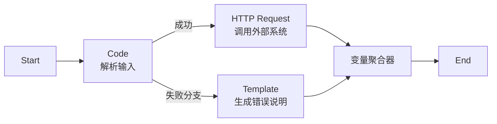
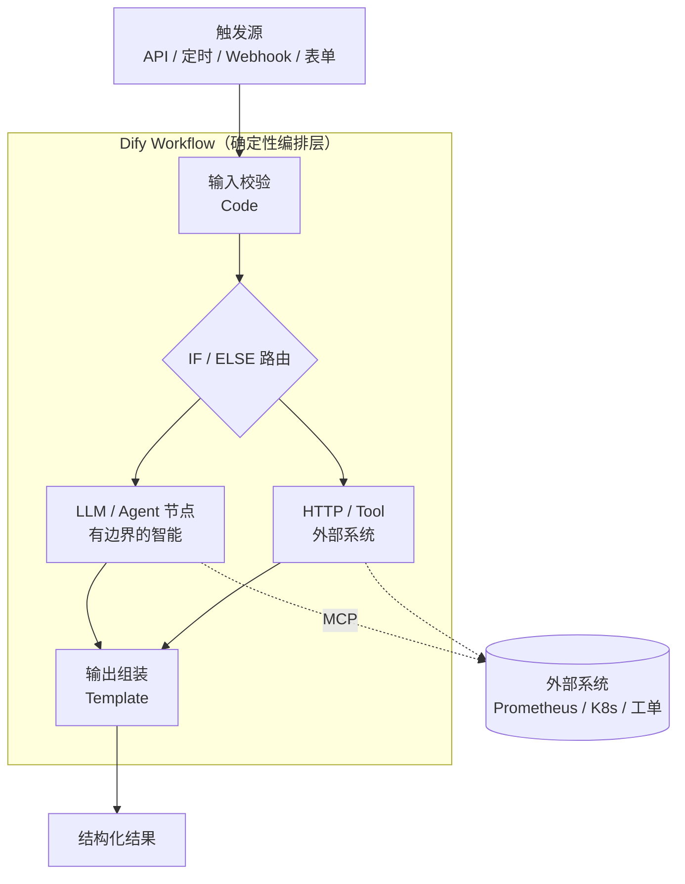
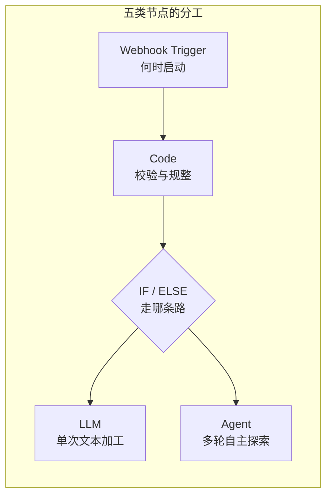
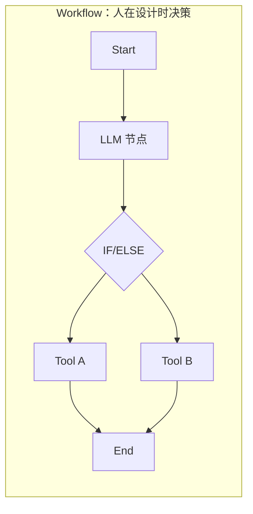
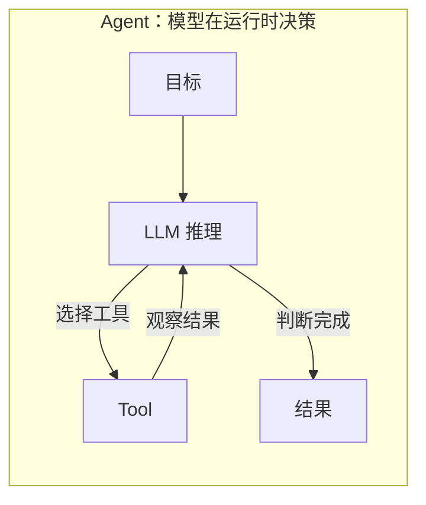
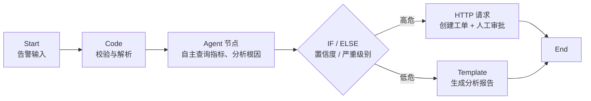
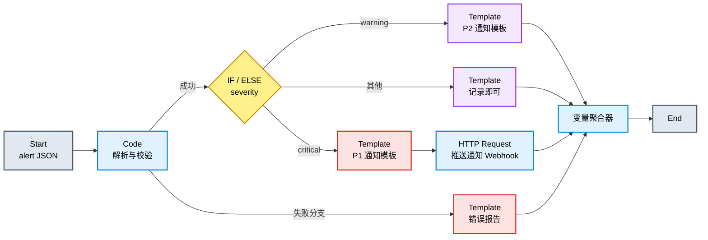
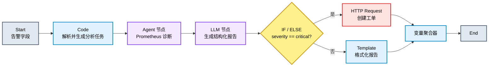
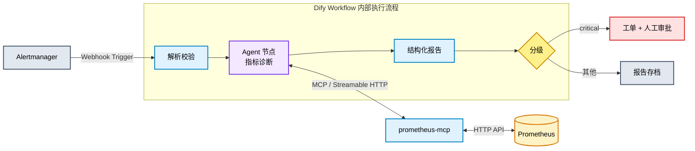

# Dify Workflow 实践教程：概念、架构与两类实战工作流

> **文档性质**：概念讲解 + 动手实验教程
>
> **适用读者**：Linux 应用运维工程师、SRE、AI Infra / LLMOps 工程师、AI Agent 应用开发者
>
> **环境基准**：**Dify 1.17.1**（Docker Compose 部署）、prometheus-mcp、Prometheus 2.x/3.x
>
> **文档作者：**马哥教育（http://www.magedu.com）AI课程团队
>
> **版权声明：**本教程为[马哥教育](http://www.magedu.com)原创，转载必须经过作者同意
>
> **版本适配说明**：本教程以 Dify 1.17.1 为基准编写并核对。相对早期版本，1.17.x 在 Workflow 领域的重要变化包括：1.17.0 引入 **Human Input 节点**（流程内人机交互表单，支持在 Iteration / Loop 内使用）与**可复用 LLM 环境变量**（模型配置一处定义、多节点引用），并将 Workflow 默认执行超时上限由 1200 秒提升至 3600 秒；1.17.1 进一步修复了 Human Input 的多个恢复缺陷、Loop 节点布尔跳出条件失效，以及 Workflow-as-Tool 只暴露第一个 End 节点输出的问题。

---

## 前言

Dify Workflow 是 Dify 平台中最接近"工程化 AI 应用"的应用形态：它将 LLM、工具、代码与外部系统编排为**确定性的、可审计的执行流程**。本教程分为概念与实践两部分：

- **第 1 章**讲清 Workflow 的核心概念、节点体系与执行模型；
- **第 2 章**深入辨析 Workflow 与 Agent 的本质区别与选型方法——这是初学者最容易混淆、也是生产落地中最关键的问题；
- **第 3 章**完成一个**纯静态 Workflow**（不依赖 LLM 决策）：告警格式化与分级通知；
- **第 4 章**完成一个**基于 Agent（prometheus-mcp）的 Workflow**：告警触发的自动指标分析；
- **第 5～7 章**分别覆盖测试发布、故障排查与进阶路径。

阅读本文前，建议已完成前两篇教程中的 MCP 基础实验（Calculator MCP 与 prometheus-mcp 的部署验证）。本文假定 prometheus-mcp 已在 Dify 中注册可用。

---

# 第一章　Dify Workflow 概念与架构

## 1.1 Workflow 是什么

**Workflow 是 Dify 中以可视化画布编排的、单次执行到底的自动化流程应用**：接收一组输入，按预先设计好的节点顺序与分支条件执行，最终返回结构化结果。

它的设计动机是解决纯 LLM 应用在生产环境中的核心痛点：模型可能幻觉、跳步、输出不一致。Workflow 的思路是——**把 AI 能力嵌入到由人设计的、结构化的、可重复的流程中**，让模型在明确的边界内发挥作用，而不是让模型独自决定一切。

## 1.2 Dify 应用类型全景

Dify 提供五种应用类型，Workflow 只是其中之一：

| 应用类型     | 交互模式                    | 典型场景                     |
| ------------ | --------------------------- | ---------------------------- |
| 聊天助手     | 多轮对话                    | 客服机器人、知识问答         |
| Agent        | 多轮对话 + 模型自主工具调用 | 开放任务的自主执行           |
| 文本生成     | 单次生成                    | 文案、翻译、摘要             |
| **Workflow** | 单次执行，输入 → 输出       | 批处理、数据管道、自动化流程 |
| Chatflow     | 对话式工作流                | 需要结构化流程支撑的多轮对话 |

Workflow 与 Chatflow 共享同一套画布与节点系统，核心区别在于交互方式：

```text
Workflow：一次运行从头到尾执行完毕
  输入 → 流程 → 结果（结束节点 End）

Chatflow：叠加了对话层
  每条用户消息触发一次流程（回复节点 Answer）
```

因此，**Chatflow 天然从用户消息出发，Workflow 则可以从表单输入、API 调用或触发器（定时 / Webhook）启动**；Workflow 没有对话记忆与会话变量，每次运行都是全新、独立的执行。这一"无状态单次执行"特性也使 Workflow 可以被**发布为工具**，供其他 Workflow、Chatflow 或 Agent 复用。

## 1.3 节点体系

Workflow 由节点（Node）连接而成。节点按功能可分为六类：

| 类别      | 节点                                                         | 作用                                                      |
| --------- | ------------------------------------------------------------ | --------------------------------------------------------- |
| 核心流程  | Start / End / Answer                                         | 定义输入、终止并输出结果（Answer 用于 Chatflow 流式回复） |
| LLM 与 AI | LLM、Agent、参数提取器                                       | 调用模型生成、自主推理、从文本提取结构化参数              |
| 逻辑控制  | IF/ELSE、问题分类器、迭代（Iteration）、循环（Loop）         | 条件分支、意图路由、批量处理                              |
| 数据处理  | 代码执行（Code）、模板转换、变量聚合器、变量赋值、列表操作、文档提取 | 数据加工与分支汇聚                                        |
| 外部集成  | HTTP 请求、工具（Tool）、知识检索                            | 调用外部 API、MCP/内置工具、知识库                        |
| 触发器    | 定时触发、Webhook 触发、插件触发                             | 无需用户输入，事件驱动启动流程                            |

节点间的数据传递通过**变量引用**完成，语法形如 `{{#node_id.output_name#}}`。例如 Start 节点定义的输入变量、Code 节点的命名输出、HTTP 请求节点的响应体，均可被下游节点引用。

## 1.4 执行模型与错误处理

理解 Workflow 的执行模型，需要抓住四个要点：

1. **确定性路径**：节点、分支、变量在发布前即已确定，运行时不会有模型"临时决定走哪条路"（Agent 节点内部的推理除外，且被约束在单个节点内）；
2. **逐节点可观测**：每次运行都会记录每个节点的输入、输出、耗时与状态，形成完整的执行 Trace，支持审计与回放；
3. **显式错误策略**：LLM、工具、HTTP 请求、代码等节点支持四种错误处理策略：
   - `abort`（默认）：出错即终止整个流程；
   - `retry`：按配置重试；
   - `default-value`：返回预定义默认值，主流程继续；
   - `fail-branch`：进入失败分支，下游通过**变量聚合器**与成功分支汇合后继续执行；
4. **可发布为工具**：Workflow 可整体封装为一个 Tool，被其他应用调用。**版本提示**：1.17.1 之前，Workflow-as-Tool 只暴露第一个 End 节点的输出；1.17.1 起会汇总所有 End 节点的输出声明，并对重名 / 保留名给出警告。若流程包含多个互斥的 End 分支，升级前请注意此行为差异。

一个典型的带错误处理的 Workflow 结构：



## 1.5 Workflow 在 AI 应用架构中的位置



可以看到，Workflow 在架构中扮演的是**编排层（Orchestration）**角色——这与前文理论篇中"Agent ≈ LLM + … + Workflow + MCP + Governance"的公式相呼应：Workflow 负责把模型、工具、外部系统组织成可控的流程。

## 1.6 常用节点使用详解

本节对实践中使用频率最高的五类节点给出配置要点与注意事项，后续两章实践均会用到。

### 1.6.1 Webhook Trigger：事件驱动的流程入口

Webhook Trigger 让 Workflow 不再依赖"人去点运行"或"定时轮询"，而是由外部系统的事件主动触发——典型场景就是 Alertmanager 的 webhook receiver"告警即触发"。

配置要点：

1. 在画布中将流程起点从 Start（用户输入）切换为 **Webhook Trigger**（触发器与用户输入起点互斥，一个流程只能有一个入口）；

2. 发布后，Dify 会为该触发器生成一个公开回调地址，形如：

   ```text
   POST https://<dify-host>/triggers/webhook/{trigger_id}
   ```

   在 Alertmanager 的 `webhook_configs.url` 中填写该地址即可；

3. 触发器自动解析请求体，可将 `body` 中的字段（如 `alerts[0].labels.alertname`）映射为流程变量；建议先用一次真实告警调用，在 Trace 中确认字段映射无误；

4. **安全建议**：公开回调地址本身即为凭据，应妥善保管；Alertmanager 与 Dify 之间建议走内网或加签名校验的反向代理。

> 与 Webhook Trigger 并列的还有 **Schedule Trigger**（cron 定时触发，适合周期巡检）与插件触发器，配置方式类似。

### 1.6.2 LLM 节点：单次、确定输入输出的文本加工

LLM 节点是 Workflow 中最基础的 AI 节点：**一次模型调用，输入确定则输出可预期**。配置要点：

| 配置项               | 说明                                                         |
| -------------------- | ------------------------------------------------------------ |
| 模型                 | 选择已配置的模型；1.17.0 起可引用工作区级**可复用 LLM 环境变量**（如 `for_summarize`、`for_research`），统一调整模型时无需逐节点修改 |
| System / User Prompt | 支持变量引用 `{{#node_id.output#}}`；System 定角色与规则，User 承载具体输入 |
| 输出格式             | 可开启结构化输出（JSON Schema），下游节点直接按字段引用，避免正则解析 |
| 错误策略             | 同其他节点，支持 abort / retry / default-value / fail-branch |

使用建议：LLM 节点适合"翻译、摘要、格式化、结构化提取"这类**输入输出关系明确**的任务；凡涉及多轮探索与工具调用，应改用 Agent 节点（见下）。

### 1.6.3 Agent 节点：被约束在流程内的自主推理

Agent 节点把"模型自主决策 + 工具调用"的循环封装为单个节点。核心配置：

| 配置项              | 说明                                                         |
| ------------------- | ------------------------------------------------------------ |
| Agent Strategy      | 推理策略，内置 **Function Calling**（模型原生工具调用）与 **ReAct**（思考-行动-观察交替）两种；模型原生支持 Function Calling 时优先选前者 |
| 模型                | 必须可靠支持 Tool Calling（自部署 vLLM 需启用 `--enable-auto-tool-choice` 及匹配的 tool-call parser） |
| Instruction / Query | Instruction 定规则与边界，Query 承载本次任务输入（通常引用上游节点输出） |
| 工具                | 从已注册的工具（含 MCP Server）中勾选，**按需最小化**，不要把危险写工具交给 Agent |
| 最大迭代次数        | 限制推理-工具循环的轮数（如 8～10），防止失控消耗 token      |

下游节点通过 Agent 节点的输出变量（如最终文本 `text`）消费其结果。需要牢记：**Agent 节点内部的工具调用不受流程分支约束**，因此对写操作类工具的管控应在"不给 Agent 节点配置"这一层完成。

### 1.6.4 IF/ELSE：条件分支路由

IF/ELSE 节点按条件组把流程路由到不同分支：

- 每个条件由"变量 + 比较符 + 值"构成，比较符包括 `is` / `is not` / `contains` / `not contains` / `empty` / `not empty` 及数值比较（`>`、`>=` 等）；
- 同一分支内的多个条件可组合 `AND` / `OR`；
- 分支按从上到下的顺序求值，**第一个命中的分支即被选中**，其后是兜底的 ELSE 分支——因此更严格的条件应放在更靠前的位置；
- 常见误区：分支条件写在上游字符串变量上时，注意空值（`empty`）与未命中的区别，ELSE 会吞掉所有未命中情况，调试时应先在 ELSE 分支放占位输出。

### 1.6.5 Code：代码执行节点

Code 节点在沙箱中执行 Python 3 或 JavaScript 代码，用于输入校验、数据规整、格式转换等确定性逻辑。使用要点：

1. **函数签名约定**：入口函数名为 `main`，参数名即输入变量（需与节点输入配置一致），返回 `dict`，其键即输出变量名；
2. **环境限制**：沙箱内无网络访问、无文件系统持久化，标准库可用、第三方库不可用；复杂逻辑应拆到外部服务，用 HTTP Request 节点调用；
3. **执行时限**：受沙箱超时约束（默认数秒级），不适合大数据量计算；
4. **错误处理**：`raise` 异常即视为节点失败，配合 fail-branch 错误策略可将非法输入导入失败分支（本教程第 3 章实践即采用此模式）；
5. **输出声明**：返回字典的每个键必须在节点"输出变量"中显式声明类型，否则下游无法引用。



---

# 第二章　Workflow 与 Agent 的区别

## 2.1 本质区别：执行路径的归属权

Workflow 与 Agent 都可以调用 LLM、都可以使用工具，表面上功能重叠。**二者的本质区别不在于"用了什么能力"，而在于"谁在运行时决定下一步"**：

```text
Workflow：执行路径在发布前由人设计
  → 节点、分支、顺序、终止条件全部确定
  → 运行时"按图执行"

Agent：执行路径在运行时由模型决策
  → 模型根据中间结果自主选择工具、决定下一步
  → 形成一个"思考 → 行动 → 观察 → 再思考"的循环
```

用一句话概括：

> **Workflow 中，LLM 是流程里的一个"零件"；Agent 中，LLM 是流程本身的"驾驶员"。**





## 2.2 系统性对比

| 维度       | Workflow                           | Agent                                            |
| ---------- | ---------------------------------- | ------------------------------------------------ |
| 路径控制   | 设计时确定，可视化、可评审         | 运行时由模型在上下文中决策                       |
| 工具选择   | 节点配置时固定                     | 模型根据证据自主选择                             |
| 可预测性   | 高：同样输入走同样路径             | 低：路径随模型与上下文变化                       |
| 副作用管控 | 写操作位置固定，便于审批与幂等设计 | 写操作由模型触发，边界需额外约束                 |
| 审计与回放 | 每个节点输入输出可回放             | 需要完整记录每轮推理与工具调用                   |
| 失败恢复   | 失败分支、重试、默认值均显式配置   | 依赖模型对错误的理解，可能"把失败解释成成功"     |
| 成本与延迟 | 可预估                             | 随推理轮数波动（受 `maximum_iterations` 等约束） |
| 适用任务   | 步骤已知、可枚举分支               | 路径依赖运行时发现的新证据                       |

## 2.3 选型决策方法

推荐按以下顺序判断（"先评估副作用，再评估自主性"）：

1. **步骤、分支与完成条件是否在设计时已知？** 已知 → Workflow；把稳定规则强行改成 Agent，只会把可测试的确定性逻辑变成概率路径，并增加 token、日志与回归成本；
2. **工具是否会产生昂贵或不可逆的副作用？** 是 → 副作用权限应放在确定性路径中（Workflow），并配套审批、幂等与补偿机制；
3. **工具选择是否依赖运行中新发现的证据？** 是 → Agent 更合适（如开放域的故障根因探索）；
4. **结果是否由人复核、无直接副作用？** 是 → Agent 的自主性风险可控。

以 SRE 场景为例：

```text
告警分级、字段校验、工单创建      → Workflow（步骤已知 + 有副作用）
"这个告警的根因是什么"           → Agent（路径依赖查询过程中发现的证据）
```

## 2.4 混合架构：Workflow 编排 + Agent 节点

生产实践中最优解往往是混合架构：**Workflow 掌握校验、权限、写操作与终止，Agent 只负责一个有边界的推理子任务**。

Dify 的 **Agent 节点**正是为此设计：它将一段"模型自主决策 + 工具调用"的循环封装为流程中的单个节点——上游为其提供任务输入，下游像对待 LLM 节点一样消费它的最终输出。Agent 节点的推理策略（Agent Strategy）可插拔，Dify 内置了 ReAct 等经典策略。



这就是本教程第 4 章实践所采用的结构。


---

# 第三章　实践一：纯静态 Workflow——告警分级与通知

## 3.1 实验目标

构建一个**完全不依赖 LLM 决策**的 Workflow：接收 Alertmanager 风格的告警 JSON，完成解析、分级、格式化与通知下发。它证明一个重要观点：

> **Workflow 不是"LLM 应用的另一种写法"，而是一个可以按需使用（或完全不使用）模型的自动化流程引擎。**

### 3.1.1 流程设计



### 3.1.2 涉及节点

Start、Code、IF/ELSE、Template Transform、HTTP Request、变量聚合器、End——全部来自"核心流程 / 逻辑控制 / 数据处理 / 外部集成"类别，不含任何 LLM 或 Agent 节点。

## 3.2 节点配置

### 3.2.1 Start 节点

定义输入变量：

| 变量名      | 类型   | 说明                                  |
| ----------- | ------ | ------------------------------------- |
| `alertname` | String | 告警名称                              |
| `severity`  | String | 严重级别（critical / warning / info） |
| `instance`  | String | 实例标识                              |
| `summary`   | String | 告警摘要                              |
| `starts_at` | String | 触发时间（RFC3339）                   |

### 3.2.2 Code 节点：解析与校验

Code 节点（Python 3）负责输入校验与字段规整：

```python
def main(alertname: str, severity: str, instance: str,
         summary: str, starts_at: str) -> dict:
    allowed = {"critical", "warning", "info"}
    if severity not in allowed:
        raise ValueError(f"unknown severity: {severity}")
    if not alertname or not instance:
        raise ValueError("alertname and instance must not be empty")

    level_map = {"critical": "P1", "warning": "P2", "info": "P3"}
    return {
        "level": level_map[severity],
        "title": f"[{level_map[severity]}] {alertname} @ {instance}",
        "detail": f"告警：{alertname}\n实例：{instance}\n"
                  f"级别：{severity}\n时间：{starts_at}\n摘要：{summary}",
    }
```

配置 Code 节点的错误策略为 **fail-branch**，使非法输入进入失败分支而不是终止整个流程。

### 3.2.3 IF/ELSE 节点：按 severity 路由

以 Start 节点的 `severity` 为条件，建立三条分支：

```text
分支 1：severity is "critical"
分支 2：severity is "warning"
ELSE  ：其余（info 等）
```

### 3.2.4 Template 节点：生成通知文本

以 critical 分支为例（引用 Code 节点输出 `{{#code.title#}}`、`{{#code.detail#}}`）：

```text
【紧急告警】{{ title }}

{{ detail }}

请值班同学立即介入处理。
```

warning 与 info 分支使用措辞更缓和的模板。

### 3.2.5 HTTP Request 节点：下发通知

critical 分支追加一个 HTTP Request 节点，将通知推送到企业的 Webhook（如内部 IM 机器人）：

```text
Method: POST
URL:    https://im.example.com/webhook/alert
Body:   {"text": "{{#template_critical.output#}}"}
```

该节点建议配置 `retry`（例如最多 2 次、间隔 5 秒），应对通知网关的瞬时抖动。

### 3.2.6 变量聚合器与 End

三条互斥分支各自产生"通知文本"，使用**变量聚合器**将分支输出汇聚为单一变量 `final_text`（聚合器专为互斥分支设计：运行时只有一个分支有值，聚合器原样透出该值），End 节点输出：

```text
level      ← Code.level
final_text ← 变量聚合器.output
```

## 3.3 测试与验证

### 3.3.1 画布内测试

点击"运行"，在表单中填入：

```text
alertname: VllmHighTTFT
severity:  critical
instance:  vllm-prod-01
summary:   TTFT p99 > 3s for 5m
starts_at: 2026-09-14T08:30:00Z
```

预期：流程沿 critical 分支执行，HTTP Request 节点成功，End 输出 `level=P1` 与完整通知文本。在 Trace 中逐节点检查输入输出。

### 3.3.2 通过 API 测试

发布后获取 API Key。Workflow 应用使用 `POST /v1/workflows/run`：

```bash
export DIFY_URL="http://192.168.1.20/v1"
export DIFY_API_KEY="app-xxxxxxxxxxxxxxxx"

curl -N \
  -X POST \
  "${DIFY_URL}/workflows/run" \
  -H "Authorization: Bearer ${DIFY_API_KEY}" \
  -H "Content-Type: application/json" \
  -d '{
    "inputs": {
      "alertname": "VllmHighTTFT",
      "severity": "critical",
      "instance": "vllm-prod-01",
      "summary": "TTFT p99 > 3s for 5m",
      "starts_at": "2026-09-14T08:30:00Z"
    },
    "response_mode": "streaming",
    "user": "workflow-test"
  }'
```

响应为 SSE 事件流，依次出现 `workflow_started`、各节点的 `node_started` / `node_finished`，最终以 `workflow_finished` 收尾，其中 `data.outputs` 即为 End 节点定义的结果。

### 3.3.3 错误路径测试

传入非法 severity（如 `fatal`），验证流程进入 Code 节点的 fail-branch、由错误模板生成说明、流程正常结束而非整体失败：

```text
预期：workflow_finished，status = succeeded
     outputs.final_text = 输入校验失败的说明文本
```

---

# 第四章　实践二：基于 Agent（prometheus-mcp）的告警分析 Workflow

## 4.1 实验目标

构建一个混合架构 Workflow：接收告警输入后，由 **Agent 节点**自主调用 prometheus-mcp 的工具完成指标分析，再由确定性节点完成输出组装与分级处置。这是 AI-SRE 自动诊断链路的最小可用形态：

```text
Alertmanager ──（告警）──▶ Dify Workflow
                              │
                              ├─ 确定性：输入解析、分级、输出
                              │
                              └─ Agent 节点 ──（MCP）──▶ prometheus-mcp ──▶ Prometheus
```

## 4.2 前置条件

- prometheus-mcp 已部署并在 Dify 中注册（参见过往教程第 4～5 章），工具列表可见；
- Agent 节点使用的模型可靠支持 Function Calling / Tool Calling（如 Qwen3.5-9B + vLLM，启用 `--enable-auto-tool-choice` 与匹配的 tool-call parser）。

## 4.3 流程设计



设计要点：**Agent 节点的输出必须经过下游确定性节点加工后才允许触发副作用**（创建工单）。Agent 负责"读"与"分析"，Workflow 负责"写"——这正是第 2.4 节混合架构原则的落地。

## 4.4 节点配置

### 4.4.1 Start 节点

| 变量名      | 类型   | 说明     |
| ----------- | ------ | -------- |
| `alertname` | String | 告警名称 |
| `severity`  | String | 严重级别 |
| `instance`  | String | 实例标识 |
| `summary`   | String | 告警摘要 |

### 4.4.2 Code 节点：生成分析任务描述

将告警字段组装为一段给 Agent 的自然语言任务：

```python
def main(alertname: str, severity: str, instance: str,
         summary: str) -> dict:
    task = (
        f"收到 Prometheus 告警，请完成诊断分析：\n"
        f"- 告警名称：{alertname}\n"
        f"- 严重级别：{severity}\n"
        f"- 实例：{instance}\n"
        f"- 摘要：{summary}\n\n"
        f"要求：\n"
        f"1. 用 list_alerts 确认该告警的当前状态与标签；\n"
        f"2. 根据告警涉及的服务，用 query 查询相关核心指标\n"
        f"   （如请求速率、错误率、延迟分位数、资源使用率）；\n"
        f"3. 用 range_query 查看最近 30 分钟的趋势；\n"
        f"4. 用 list_targets 确认相关采集目标是否健康；\n"
        f"5. 给出最可能的根因假设与下一步排查建议。"
    )
    return {"task": task, "level": severity}
```

### 4.4.3 Agent 节点：自主诊断

关键配置：

| 配置项         | 取值                                                         |
| -------------- | ------------------------------------------------------------ |
| Agent Strategy | Function Calling / ReAct（内置策略）                         |
| 模型           | 支持 Tool Calling 的模型                                     |
| Instruction    | 引用 Code 节点输出 `{{#code.task#}}`                         |
| 工具           | Prometheus MCP：`query`、`range_query`、`list_alerts`、`list_targets`（按需加 `label_names`、`metric_metadata`） |
| 最大迭代次数   | 8～10（防止无限循环）                                        |

Agent 节点的 Instruction 中应加入与《Prometheus MCP 实践教程》第 5.2 节类似的工程规则：

```text
- 所有指标结论必须来自 MCP 工具的真实查询结果，禁止编造数值；
- 断言某指标"为 0 或不存在"之前，先用 list_targets 确认采集目标健康；
- 趋势判断使用 range_query，不要使用单个瞬时值下结论；
- 最终输出结构：告警确认 → 关键指标观测 → 根因假设 → 建议动作。
```

### 4.4.4 LLM 节点：生成结构化报告

Agent 节点的原始输出偏叙述性，追加一个 LLM 节点将其压缩为结构化报告（引用 `{{#agent.text#}}`）：

```text
请将以下诊断分析整理为固定格式的中文报告，包含四个小节：
【告警概况】【指标观测】【根因假设】【建议动作】。
不得添加原始分析中不存在的结论。

原始分析：
{{#agent.text#}}
```

> 这里体现了"LLM 节点 vs Agent 节点"的分工：LLM 节点做**单次、确定输入输出的文本加工**；Agent 节点做**需要多轮工具交互的探索性任务**。

### 4.4.5 IF/ELSE + HTTP Request：分级处置

- `severity is "critical"` 分支：HTTP Request 调用工单系统 API，body 中携带报告文本（引用 LLM 节点输出）；
- ELSE 分支：Template 节点直接格式化报告。

### 4.4.6 变量聚合器与 End

汇聚两条互斥分支，End 输出：

```text
report     ← 变量聚合器.output
agent_text ← Agent 节点.text（原始分析，供审计）
```

## 4.5 端到端测试

### 4.5.1 测试用例

```bash
curl -N \
  -X POST \
  "${DIFY_URL}/workflows/run" \
  -H "Authorization: Bearer ${DIFY_API_KEY}" \
  -H "Content-Type: application/json" \
  -d '{
    "inputs": {
      "alertname": "VllmHighTTFT",
      "severity": "critical",
      "instance": "vllm-prod-01",
      "summary": "vLLM TTFT p99 超过 3s 已持续 5 分钟"
    },
    "response_mode": "streaming",
    "user": "ai-sre-test"
  }'
```

### 4.5.2 验收要点

1. **Trace 中 Agent 节点可见多轮工具调用**：依次出现 `list_alerts`、`query`、`range_query`、`list_targets` 等 Tool Call，每轮有真实的输入参数与返回结果；
2. **prometheus-mcp 日志同步出现 `POST /mcp` 请求**，与 Dify Trace 构成两端证据；
3. **报告中所有数值都能在 Trace 的工具返回中找到出处**——这是验证"模型没有编造数据"的关键检查；
4. critical 输入下工单创建成功，非 critical 输入下不创建工单；
5. Agent 节点未超过最大迭代次数（超过说明任务描述或工具集需要优化）。

### 4.5.3 与纯 Agent App 的对照

同样的能力也可以用纯 Agent App 实现，但 Workflow 版本的优势在本实验中清晰可见：

| 关注点   | 纯 Agent App       | 本 Workflow                               |
| -------- | ------------------ | ----------------------------------------- |
| 输入校验 | 依赖模型自觉       | Code 节点强制，非法输入走失败分支         |
| 报告格式 | 依赖模型自觉       | LLM 节点固定模板，输出稳定                |
| 工单创建 | 模型直接持有写工具 | 仅 critical 分支触发，Workflow 掌控写权限 |
| 审计     | 推理轨迹           | 逐节点 Trace + Agent 内部轨迹，双层可回放 |

---

# 第五章　发布、触发与运行管理

## 5.1 发布与 API 接入

Workflow 调试通过后执行 **Publish**，在 Access → API 创建 API Key。调用要点：

- 端点：`POST /v1/workflows/run`；
- `inputs` 必须与 Start 节点定义的变量名、类型完全一致，缺少必填变量会直接 400；
- `response_mode` 支持 `streaming` 与 `blocking`（Workflow 应用不受新版 Agent App "仅 streaming" 的限制，但生产集成仍建议 streaming，便于观察节点进度与及早发现异常）。

## 5.2 触发方式

除 API 调用外，Workflow 还支持：

- **定时触发（Schedule Trigger）**：如每小时生成一次巡检报告；
- **Webhook 触发（Webhook Trigger）**：对接 Alertmanager 的 webhook receiver，实现"告警即触发"；
- **发布为工具**：将本 Workflow 封装为 Tool，供其他 Workflow、Chatflow 或 Agent 复用（例如把"告警分析 Workflow"作为工具挂进一个更大的值班助手 Agent）。

> 注意：触发器节点与用户输入 Start 节点是互斥的流程起点，一个 Workflow 只能有一个入口。

## 5.3 运行观测

每次运行在 Logs 中留下完整记录：节点级输入输出、分支走向、耗时、token 消耗。建议关注三类指标：

```text
结果指标：任务成功率、输出被下游采纳率
路径指标：Agent 节点平均迭代轮数、分支分布
资源指标：token 消耗、节点延迟、外部调用耗时
```

---

# 第六章　故障排查

## 6.1 排查顺序

```text
① Start 输入：inputs 与变量定义是否匹配？（400 错误的高发原因）
② 逐节点 Trace：流程停在哪一个节点？
③ Code 节点：输入校验是否抛错？是否走了 fail-branch？
④ Agent 节点：模型是否产生 tool_call？迭代是否耗尽？
⑤ MCP 链路：prometheus-mcp 日志是否收到请求？（参考前篇十层排查链）
⑥ HTTP Request 节点：外部系统状态码与响应体？
⑦ 变量引用：下游节点引用的变量名是否与上游输出一致？
```

## 6.2 常见问题

### 6.2.1 变量引用为空

最常见原因是引用了**互斥分支另一侧**的节点输出——运行时该分支未执行，变量无值。跨分支汇聚必须使用变量聚合器。

### 6.2.2 Agent 节点不调用工具

与纯 Agent App 同理：确认模型支持 Function Calling、推理后端启用 tool choice 与 parser、Instruction 中明确要求使用工具。先单独在 Agent App 中验证同一模型与工具集，再迁回 Workflow。

### 6.2.3 流程"成功"但结果为空

Workflow 整体状态为 succeeded 不代表业务成功：若上游节点走了 default-value 错误策略，空值会静默传递。对关键节点应优先使用 fail-branch 并让失败显式可见。

### 6.2.4 迭代/循环节点超时

处理告警列表等批量数据时，Iteration 节点逐项调用 LLM 或工具会放大延迟。先用小样本验证单项处理逻辑，再放开批量；必要时在列表操作节点先做过滤收敛。

### 6.2.5 Loop 节点的布尔跳出条件不生效（1.17.1 之前）

1.17.1 之前，Loop 节点新建布尔类型的跳出条件时，编辑器会将 `"true"` / `"false"` 存为字符串而非布尔值，导致条件永不命中、循环无法按预期退出。1.17.1 已修复；若使用更早版本，可改用数值比较（如 `count >= 5`）规避。

---

# 第七章　总结与进阶路径

## 7.1 本教程建立的认知框架

```text
Workflow = 确定性的编排层（路径归属人）
Agent    = 有边界的自主推理（路径归属模型）
MCP      = 标准化的能力连接（工具归属协议）
```

三者的正确组合方式是：**Workflow 掌控校验、分级、写操作与终止；Agent 节点在边界内完成探索性分析；MCP 为 Agent 提供标准化的外部能力**。

## 7.2 完整的 AI-SRE 参考链路



## 7.3 进阶方向

1. **知识库增强**：在 Agent 节点前追加知识检索节点，让诊断参考历史故障手册（RAG + MCP 组合）；
2. **多 MCP 组合**：为 Agent 节点同时挂载 prometheus-mcp 与 Kubernetes MCP，实现"指标 + 资源状态"联合诊断；
3. **写操作治理**：对创建工单、执行变更类节点接入审批流，落实最小权限与 Human-in-the-loop；
4. **Workflow 工具化**：将稳定的诊断 Workflow 发布为工具，供值班助手 Agent 调用，形成分层复用。

---

# 附录　参考资料

1. Dify 官方文档：Workflow & Chatflow：<https://docs.dify.ai/en/cloud/use-dify/build/workflow-chatflow>
2. Dify 官方文档：Variable Aggregator 节点：<https://docs.dify.ai/en/cloud/use-dify/nodes/variable-aggregator>
3. Dify 官方博客：Agent Node 介绍：<https://dify.ai/blog/dify-agent-node-introduction-when-workflows-learn-autonomous-reasoning>
4. Dify Workflow 节点类型参考（社区整理）：<https://github.com/twwch/workflow-skill>
5. prometheus-mcp 官方仓库：<https://github.com/prometheus/prometheus-mcp>
6. Dify Releases（1.17.0 / 1.17.1 变更说明）：<https://github.com/langgenius/dify/releases>
7. Dify 官方文档：Workflow App API（/v1/workflows/run）：<https://docs.dify.ai/en/api-reference/guides/workflow>
