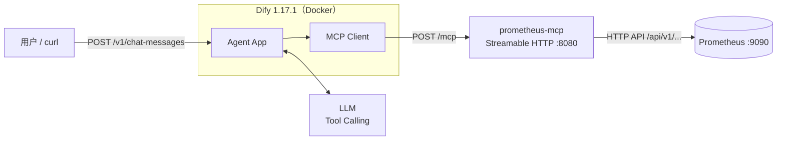

# Prometheus-MCP 实践教程

> **文档性质**：动手实验教程
>
> **适用读者**：Linux 应用运维工程师、SRE、AI Infra / LLMOps 工程师、AI Agent 应用开发者
>
> **环境基准**：prometheus-mcp（v0.18.x 时代版本）、Dify 1.17.1、Prometheus 2.x/3.x
>
> **文档作者**：马哥教育（http://www.magedu.com）
>
> **版权说明：**原创文档，转载必须经过作者同意

---

## 前言

本教程介绍 Prometheus 官方 MCP Server——**prometheus-mcp**（仓库：`prometheus/prometheus-mcp`）的部署、协议级手动测试，以及与 Dify 1.17.1 的完整集成过程。

全文结构如下：

- **第 1 章**介绍 prometheus-mcp 的项目背景、工具体系与实验总体架构；
- **第 2 章**完成 prometheus-mcp 的部署与启动；
- **第 3 章**在接入 Dify 之前，通过 curl 对 MCP Server 进行协议级手动验证；
- **第 4 章**处理 Docker 环境下的网络问题，并在 Dify 中注册 MCP Server；
- **第 5 章**创建 Agent 应用，完成 UI 内与 API 两条路径的端到端验证；
- **第 6 章**讨论安全与生产化配置；
- **第 7 章**给出标准化的故障排查路径；
- **第 8 章**总结实验路径，并说明如何以此为基础构建 AI-SRE 自动诊断链路。

阅读本文前，建议先完成 Calculator MCP 最小实验（参见《MCP 动手实践：基于 Dify 1.17.1 的 Calculator MCP Server 端到端验证》）。二者的验证方法论完全一致，本文不再重复展开 Dify 侧的基础概念。

---

# 第一章　prometheus-mcp 概述

## 1.1 项目背景

prometheus-mcp 是 Prometheus 项目官方的 MCP Server，让 LLM 应用能够以标准化协议直接访问 Prometheus 实例。该项目最初由社区作者以 `tjhop/prometheus-mcp-server` 名义开发，后被正式接纳并迁移至 Prometheus 官方 GitHub 组织，即 `prometheus/prometheus-mcp`；旧仓库地址已 301 重定向至新地址。需要注意：**发布产物（Release 二进制与容器镜像）目前仍沿用 `tjhop` 命名空间**（如 `ghcr.io/tjhop/prometheus-mcp-server`），这不影响其官方属性。

项目主要特性：

- Go 语言实现，单二进制交付，同时提供容器镜像、deb/rpm 系统包与 Helm Chart；
- 支持 **stdio** 与 **Streamable HTTP**（同时兼容旧 SSE）两种传输方式；
- 每个命令行参数均有对应的 `PROMETHEUS_MCP_SERVER_*` 环境变量；
- 除工具（Tools）外，还内置 Prometheus 官方文档语料，以 Tools（`docs_list` / `docs_read` / `docs_search`）和 Resources（`prometheus://docs`）两种形式提供；
- 显式支持 Prometheus 兼容后端：通过 `--prometheus.backend` 可切换至 Thanos 等后端（自动增删不适用的工具）。

## 1.2 工具体系

默认配置下，prometheus-mcp 通过 `tools/list` 注册 **28 个工具**，可划分为六类：

| 类别         | 工具                                                         | 用途                                     |
| ------------ | ------------------------------------------------------------ | ---------------------------------------- |
| 查询         | `query`、`range_query`、`exemplar_query`                     | PromQL 即时查询、区间查询、Exemplar 查询 |
| 元数据       | `metric_metadata`、`label_names`、`label_values`、`series`   | 指标元数据与标签维度发现                 |
| 文档         | `docs_list`、`docs_read`、`docs_search`                      | 检索 Prometheus 官方文档                 |
| 告警         | `list_alerts`、`list_rules`、`alertmanagers`                 | 活动告警、规则、Alertmanager 实例        |
| 采集         | `list_targets`、`targets_metadata`                           | 采集目标健康状态与元数据                 |
| 实例状态     | `config`、`flags`、`runtime_info`、`build_info`、`tsdb_stats`、`wal_replay_status`、`healthy`、`ready` | 实例配置与运行状态                       |
| 管理（危险） | `snapshot`、`delete_series`、`clean_tombstones`、`reload`、`quit` | TSDB 管理与进程控制                      |

> **重要提示**：默认工具列表中包含 `quit`（优雅关闭 Prometheus 进程）与 `reload` 等具有副作用的工具。生产环境应使用 `--mcp.tools` 对工具集进行裁剪（详见第 6 章）。`core` 精简工具集仅包含查询、元数据与文档类工具：`query`、`range_query`、`metric_metadata`、`label_names`、`label_values`、`series`、`docs_list`、`docs_read`、`docs_search`。

## 1.3 实验总体架构



与 Calculator MCP 实验一样，验证必须分两层进行：

```text
第一层：直接测试 prometheus-mcp
curl → /mcp
        ↓
确认 MCP Server 与 Prometheus 后端均正常

第二层：通过 Dify 调用 MCP
curl → Dify API → Agent → MCP Server → Prometheus
        ↓
确认完整的 Dify + MCP + Prometheus 闭环
```

**必须严格按此顺序执行。**

---

# 第二章　部署与启动 prometheus-mcp

## 2.1 部署方式概览

prometheus-mcp 提供四种安装方式：

| 方式                                                         | 适用场景                                     |
| ------------------------------------------------------------ | -------------------------------------------- |
| Release 二进制                                               | 裸机 / 虚拟机直接部署                        |
| deb / rpm 系统包                                             | 附带 systemd unit 的系统化部署               |
| 容器镜像                                                     | 与 Dify 同宿主机或同编排体系部署（本文采用） |
| Helm Chart（`oci://ghcr.io/tjhop/charts/prometheus-mcp-server`） | Kubernetes 部署                              |

由于 Dify 通常以 Docker Compose 部署，本文采用**容器方式**，并将传输模式设置为 Streamable HTTP。

## 2.2 以 Streamable HTTP 模式启动

以下两种启动方法选择其中之一即可。

### 2.2.1 启动命令（方法一：Docker）

直接创建并启动Docker容器，注意必须使用 `--prometheus.url` 指向一个**真实可访问的 Prometheus Server 实例**。

```bash
docker run -d \
  --name prometheus-mcp \
  -p 8080:8080 \
  ghcr.io/tjhop/prometheus-mcp-server:latest \
  --prometheus.url "http://prometheus.magedu.com:9090" \
  --mcp.transport "http" \
  --web.listen-address ":8080"
```

上面命令中，所有命令行参数都有对应的环境变量，因此上述命令等价于：

```bash
docker run -d \
  --name prometheus-mcp \
  -p 8080:8080 \
  -e PROMETHEUS_MCP_SERVER_PROMETHEUS_URL="http://prometheus.magedu.com:9090" \
  -e PROMETHEUS_MCP_SERVER_MCP_TRANSPORT="http" \
  -e PROMETHEUS_MCP_SERVER_WEB_LISTEN_ADDRESS=":8080" \
  ghcr.io/tjhop/prometheus-mcp-server:latest
```

注意：如果 Prometheus 前端有 Basic Auth 或 Bearer Token（例如经由反向代理保护），可通过 `--http.config` 指定的配置文件提供 HTTP 客户端凭据，文件格式遵循 Prometheus 生态的 HTTP client 配置规范。

### 2.2.2 启动命令（方法二：Docker Compose）

将docker-compose.yml文件中的环境变量PROMETHEUS_MCP_SERVER_PROMETHEUS_URL的值指向真实可访问的Prometheus Server实例的地址，即可运行如下命令启动服务。

```bash
docker compose up -d
```

## 2.3 常用的启动参数

| 参数                                  | 说明                                                         |
| ------------------------------------- | ------------------------------------------------------------ |
| `--prometheus.url`                    | Prometheus 实例地址，默认 `http://127.0.0.1:9090`            |
| `--mcp.transport`                     | 传输类型：`stdio` 或 `http`，远程场景使用 `http`             |
| `--web.listen-address`                | HTTP 监听地址，默认 `:8080`                                  |
| `--mcp.tools`                         | 工具白名单；`all` 加载全部，`core` 仅加载核心工具            |
| `--prometheus.backend`                | 后端类型：`prometheus` 或 `thanos`                           |
| `--prometheus.timeout`                | 调用 Prometheus API 的超时时间，默认 1m                      |
| `--prometheus.truncation-limit`       | 返回给 LLM 的响应截断行数（0 表示不截断）                    |
| `--dangerous.enable-tsdb-admin-tools` | 启用 TSDB 管理工具（`snapshot` / `delete_series` / `clean_tombstones`），**危险，默认关闭** |
| `--web.config.file`                   | 启用 TLS 或 Basic Auth 的 exporter-toolkit 配置文件          |
| `--log.level` / `--log.format`        | 日志级别与格式                                               |

## 2.4 确认服务状态

prometheus-mcp 的 Web 服务遵循 Prometheus 生态的健康检查约定：

| 端点         | 语义                                                 |
| ------------ | ---------------------------------------------------- |
| `/-/healthy` | 存活检查：进程正常即返回 200                         |
| `/-/ready`   | 就绪检查：MCP 传输挂载完成返回 200，否则 503         |
| `/metrics`   | 自身的 Prometheus 指标（含 `prom_mcp_server_ready`） |

验证：

```bash
curl -i http://localhost:8080/-/healthy
curl -i http://localhost:8080/-/ready
```

两者均返回 `200 OK` 后，方可进入下一阶段。

> **注意**：真正的 MCP Endpoint 是 `http://<主机>:8080/mcp`。`/mcp` 是协议端点而非 REST 健康检查接口，直接 GET 不会返回 `{"status":"ok"}` 式的结果。

---

# 第三章　手动测试 prometheus-mcp

## 3.1 验证策略说明

**在接入 Dify 之前，必须先用 curl 完成协议级验证**。否则出现故障时无法区分问题位于 MCP Server、Prometheus 后端、Docker 网络、Dify MCP Client 还是 LLM Tool Calling 环节。本章依次验证：`initialize` → `tools/list` → `tools/call`（查询类、发现类、告警类工具）。

## 3.2 执行 MCP initialize

运行如下命令，发起MCP initialize操作：

```bash
curl -i \
  -X POST \
  http://localhost:8080/mcp \
  -H 'Content-Type: application/json' \
  -H 'Accept: application/json, text/event-stream' \
  -d '{
    "jsonrpc": "2.0",
    "id": 1,
    "method": "initialize",
    "params": {
      "protocolVersion": "2025-06-18",
      "capabilities": {},
      "clientInfo": {
        "name": "curl-test",
        "version": "1.0"
      }
    }
  }'
```

协议版本选用 `2025-06-18` 的原因与上一篇教程一致：Dify 1.17.1 的 MCP Client 将 `LATEST_PROTOCOL_VERSION` 定义为该版本，用它测试最接近 Dify 的实际行为。正常响应示例：

```json
{
  "jsonrpc": "2.0",
  "id": 1,
  "result": {
    "protocolVersion": "2025-06-18",
    "serverInfo": {
      "name": "prometheus-mcp-server"
    }
  }
}
```

## 3.3 测试 tools/list

运行如下命令，请求tools/list。

```bash
curl -s \
  -X POST \
  http://localhost:8080/mcp \
  -H 'Content-Type: application/json' \
  -H 'Accept: application/json, text/event-stream' \
  -H 'MCP-Protocol-Version: 2025-06-18' \
  -d '{
    "jsonrpc": "2.0",
    "id": 2,
    "method": "tools/list",
    "params": {}
  }' | jq
```

默认配置下应返回 28 个工具，至少应看到：

```text
query
range_query
metric_metadata
label_names
label_values
series
list_alerts
list_rules
list_targets
...
```

## 3.4 测试 tools/call：即时查询

调用 `query` 工具，检查所有采集目标的在线状态：

```bash
curl -s \
  -X POST \
  http://localhost:8080/mcp \
  -H 'Content-Type: application/json' \
  -H 'Accept: application/json, text/event-stream' \
  -H 'MCP-Protocol-Version: 2025-06-18' \
  -d '{
    "jsonrpc": "2.0",
    "id": 3,
    "method": "tools/call",
    "params": {
      "name": "query",
      "arguments": {
        "query": "up"
      }
    }
  }' | jq
```

预期在 `result.content` 中得到各 target 的 `up` 取值（1 为正常，0 为异常）。

## 3.5 测试 tools/call：区间查询

调用 `range_query`，例如查询最近 5 分钟的节点 CPU 使用率：

```bash
curl -s \
  -X POST \
  http://localhost:8080/mcp \
  -H 'Content-Type: application/json' \
  -H 'Accept: application/json, text/event-stream' \
  -H 'MCP-Protocol-Version: 2025-06-18' \
  -d '{
    "jsonrpc": "2.0",
    "id": 4,
    "method": "tools/call",
    "params": {
      "name": "range_query",
      "arguments": {
        "query": "rate(node_cpu_seconds_total{mode=\"user\"}[5m])",
        "start": "'"$(date -u -d '10 minutes ago' +%Y-%m-%dT%H:%M:%SZ)"'",
        "end": "'"$(date -u +%Y-%m-%dT%H:%M:%SZ)"'",
        "step": "60s"
      }
    }
  }' | jq
```

## 3.6 测试 tools/call：告警与采集目标

查询当前活动告警：

```bash
curl -s \
  -X POST \
  http://localhost:8080/mcp \
  -H 'Content-Type: application/json' \
  -H 'Accept: application/json, text/event-stream' \
  -H 'MCP-Protocol-Version: 2025-06-18' \
  -d '{
    "jsonrpc": "2.0",
    "id": 5,
    "method": "tools/call",
    "params": {
      "name": "list_alerts",
      "arguments": {}
    }
  }' | jq
```

查询采集目标健康状态：

```bash
curl -s \
  -X POST \
  http://localhost:8080/mcp \
  -H 'Content-Type: application/json' \
  -H 'Accept: application/json, text/event-stream' \
  -H 'MCP-Protocol-Version: 2025-06-18' \
  -d '{
    "jsonrpc": "2.0",
    "id": 6,
    "method": "tools/call",
    "params": {
      "name": "list_targets",
      "arguments": {}
    }
  }' | jq
```

## 3.7 阶段验收标准

以上测试全部通过后，可确认：

```text
MCP transport        OK
MCP initialize       OK
tools/list           OK
tools/call（query）  OK
tools/call（range）  OK
tools/call（alerts） OK
Prometheus 后端连通   OK
```

即 prometheus-mcp 与 Prometheus 后端的问题已全部排除。

---

# 第四章　网络处理与 Dify 注册

## 4.1 Docker 网络注意事项

与 Calculator MCP 实验相同，需要处理 Dify 容器访问 MCP Server 的网络问题。三种可选地址方案：

| 场景                                 | Dify 中填写的 URL                                            |
| ------------------------------------ | ------------------------------------------------------------ |
| Docker Desktop（MCP 在宿主机）       | `http://host.docker.internal:8080/mcp`                       |
| Linux Docker（MCP 在宿主机）         | `http://prometheus-mcp.magedu.com:8080/mcp`（宿主机 LAN IP） |
| MCP 加入 Dify 的 Docker 网络（推荐） | `http://prometheus-mcp:8080/mcp`                             |

> **注意**：`--prometheus.url` 中的地址是从 **prometheus-mcp 容器视角**访问 Prometheus 的地址，与 Dify 无关；同理，Dify 中填写的 URL 是从 **Dify API 容器视角**访问 prometheus-mcp 的地址。两者不可混淆。

## 4.2 从 Dify 容器预检连通性

进入 Dify API 容器（容器名以 `docker ps` 实际输出为准）：

```bash
docker exec -it docker-api-1 sh
```

在容器内执行 initialize 测试：

```bash
curl -i \
  -X POST \
  http://prometheus-mcp:8080/mcp \
  -H 'Content-Type: application/json' \
  -H 'Accept: application/json, text/event-stream' \
  -d '{
    "jsonrpc":"2.0",
    "id":1,
    "method":"initialize",
    "params":{
      "protocolVersion":"2025-06-18",
      "capabilities":{},
      "clientInfo":{"name":"dify-network-test","version":"1.0"}
    }
  }'
```

成功后再进入 Dify UI 操作，确保排障路径干净：

```text
Host → prometheus-mcp            OK
Dify Container → prometheus-mcp  OK
然后才验证：
Dify MCP Client → prometheus-mcp
```

## 4.3 在 Dify 1.17.1 中注册

入口：`Workspace → Integrations → MCP → Add MCP Server`（中文版：集成 → MCP）。

```text
Name:
Prometheus MCP

Server URL:
http://prometheus-mcp.magedu.com:8080/mcp

Authentication:
None
```

与 Calculator 实验一致：URL 必须指向 `/mcp` 端点本身；最小验证阶段不引入认证。

注册成功后，Dify 页面应显示完整的工具列表（默认 28 个，或被 `--mcp.tools` 裁剪后的子集）。此阶段仅证明 **Dify MCP Client → prometheus-mcp → tool discovery** 链路成功，尚未涉及 LLM。


---

# 第五章　Agent 集成与端到端验证

## 5.1 创建 Agent 并挂载工具

在 Dify 中创建 Agent 应用（`Studio → Create App → Agent`），例如命名为 `Prometheus SRE Assistant`。在工具配置中选择 **Add Tool → Prometheus MCP**，按需勾选工具。与 Calculator 实验不同，prometheus-mcp 工具数量多且包含危险工具，**不建议全量勾选**。建议的起步集合：

```text
query
range_query
metric_metadata
label_names
label_values
list_alerts
list_rules
list_targets
```

更彻底的做法是在 prometheus-mcp 启动侧通过 `--mcp.tools` 裁剪（见第 6 章），形成"服务端 + 客户端"双层控制。

## 5.2 模型要求与 System Prompt

模型必须可靠支持 Function Calling / Tool Calling（例如 Qwen3.5-9B + vLLM 并启用 `--enable-auto-tool-choice` 与匹配的 tool-call parser）。推荐的测试用 System Prompt：

```text
你是一名 SRE 助手，可以访问 Prometheus MCP 服务器。

规则：
- 必须使用 Prometheus MCP 工具来回答关于指标（metrics）、告警（alerts）和采集目标（targets）的问题。严禁捏造指标数值。
- 在断言某个指标为零或缺失之前，请先使用 list_targets 验证对应的采集目标是否处于健康状态。
- 查询瞬时值请使用 query，查询趋势请使用 range_query。
- 如果对 PromQL 语法不确定，请先使用 docs_search 查阅文档，不要靠猜。

在调用工具后，请用清晰易懂的语言总结你的发现。
```

> **设计要点**：其中"断言指标为 0 之前先检查 target 健康"是一条重要的工程规则——Prometheus 中"无数据"与"数值为 0"的查询结果形态相同，只有 `list_targets` 能区分二者，应在 Prompt 层面强制 Agent 交叉验证。

## 5.3 在 Dify UI 内执行测试

输入测试问题，例如：

```text
当前有哪些正在触发的告警？请使用工具查询，不要编造。
```

理想的执行轨迹：

```text
User
 ↓
LLM
 ↓
tool_call: list_alerts {}
 ↓
Dify MCP Client
 ↓
POST /mcp → tools/call list_alerts
 ↓
prometheus-mcp → GET /api/v1/alerts
 ↓
Prometheus
 ↓
结果沿原链路返回
 ↓
LLM 汇总分析
```

## 5.4 检查 Dify Trace 与 Server 日志

进入 Dify 的 Logs / Run History / Trace，确认存在真实的 Tool Call 记录（工具名与参数），并在 prometheus-mcp 容器日志中看到对应请求：

```bash
docker logs -f prometheus-mcp
```

两端日志相互印证，构成完整证据链：

```text
Dify Trace + prometheus-mcp 日志
```

## 5.5 发布并通过 API 调用

UI 测试通过后执行 **Publish**，创建 API Key，然后通过 Service API 调用：

```bash
export DIFY_URL="http://dify.magedu.com/v1"
export DIFY_API_KEY="app-xxxxxxxxxxxxxxxx"

curl -N \
  -X POST \
  "${DIFY_URL}/chat-messages" \
  -H "Authorization: Bearer ${DIFY_API_KEY}" \
  -H "Content-Type: application/json" \
  -d '{
    "inputs": {},
    "query": "请查询当前 firing 状态的告警，并说明各告警的 severity。",
    "response_mode": "streaming",
    "conversation_id": "",
    "user": "sre-mcp-test"
  }'
```

> **注意**：Dify 1.17.1 的新版 Agent App 仅支持 `"response_mode": "streaming"`，`blocking` 模式会直接失败；curl 必须携带 `-N` 以避免缓冲 SSE 流。

## 5.6 建议的确定性测试集

| 测试     | 提问示例                                         | 预期调用的工具                    |
| -------- | ------------------------------------------------ | --------------------------------- |
| 即时查询 | "现在所有 target 的 up 状态如何？"               | `query`                           |
| 趋势查询 | "最近 30 分钟各节点的 CPU 使用率趋势？"          | `range_query`                     |
| 告警排查 | "当前有哪些 firing 告警？"                       | `list_alerts`                     |
| 采集健康 | "有没有 down 掉的采集目标？"                     | `list_targets`                    |
| 指标发现 | "有哪些和 HTTP 请求相关的指标？"                 | `label_names` / `metric_metadata` |
| 文档检索 | "rate 和 irate 有什么区别？先查官方文档再回答。" | `docs_search` / `docs_read`       |

每个用例都应在 Dify Trace 中看到对应的 Tool Call，而不是模型直接作答。

---

# 第六章　安全与生产化配置

## 6.1 危险工具的风险

默认工具列表包含具有真实副作用的工具：

```text
quit             → 优雅关闭 Prometheus 进程（不会自动拉起）
reload           → 触发配置热加载
snapshot         → TSDB 快照
delete_series    → 删除时序数据（不可逆）
clean_tombstones → 清理墓碑数据
```

其中 `snapshot` / `delete_series` / `clean_tombstones` 的执行需要显式启用 `--dangerous.enable-tsdb-admin-tools`（默认关闭），但**注册层面的可见性与执行层面的许可不是同一回事**——即使执行被拦截，工具仍出现在 `tools/list` 中，占用模型上下文并增加误调用风险。而 `quit` 与 `reload` 默认即可执行。

> **生产原则**：参考前文理论篇的安全分级模型，`query` 等只读工具可自动调用，管理类工具必须 Human-in-the-loop 或直接不暴露。

## 6.2 工具集裁剪

**推荐在生产环境使用 `--mcp.tools` 做服务端裁剪**：

```bash
# 仅加载核心工具（查询 + 元数据 + 文档）
docker run -d \
  --name prometheus-mcp \
  -p 8080:8080 \
  ghcr.io/tjhop/prometheus-mcp-server:latest \
  --prometheus.url "http://192.168.1.100:9090" \
  --mcp.transport "http" \
  --web.listen-address ":8080" \
  --mcp.tools "core"
```

或者在核心工具基础上追加白名单：

```bash
--mcp.tools "core,list_alerts,list_rules,list_targets"
```

服务端裁剪优于仅在 Dify 侧少勾选工具：它对**所有** MCP Client 生效，是不可绕过的边界。

## 6.3 传输层安全

prometheus-mcp 基于 Prometheus 社区的 exporter-toolkit，可通过 `--web.config.file` 启用 TLS 与 Basic Auth：

```yaml
# web-config.yaml 示例
basic_auth_users:
  dify: "<bcrypt 哈希>"

tls_server_config:
  cert_file: /etc/prometheus-mcp/server.crt
  key_file: /etc/prometheus-mcp/server.key
```

启用后：

- Dify 注册 MCP Server 时，Authentication 选择 Basic Auth 并填写凭据；
- Server URL 改用 `https://`。

## 6.4 上下文窗口保护

大规模环境中，`list_rules`、`label_values` 等工具可能返回超出 LLM 上下文窗口的结果。prometheus-mcp 提供两项机制：

- **`--prometheus.truncation-limit`**：限制返回给 LLM 的响应行数（支持的工具上，模型可按需在单次调用中调整）；
- **`--mcp.enable-toon-output`**：以 TOON（Token-Oriented Object Notation）替代 JSON 输出，降低 token 消耗。

生产环境建议同时启用截断限制，并在 System Prompt 中要求模型优先使用带过滤条件的查询。

---

# 第七章　故障排查

## 7.1 排查链

沿用"自底向上、逐层确认"的排查方法：

```text
① Prometheus 是否正常？
   curl http://<prometheus>:9090/-/healthy
   curl 'http://<prometheus>:9090/api/v1/query?query=up'

② prometheus-mcp 是否监听并就绪？
   ss -lntp | grep 8080
   curl http://localhost:8080/-/ready

③ prometheus-mcp 能否访问 Prometheus？
   docker logs prometheus-mcp（查看后端连接错误）

④ Host 本机 initialize / tools/list 是否成功？
   curl → localhost:8080/mcp

⑤ Dify API 容器能否访问 prometheus-mcp？
   docker exec dify-api ... curl → prometheus-mcp:8080/mcp

⑥ Dify MCP 页面是否显示工具列表？

⑦ Agent 是否加载了正确的工具子集？

⑧ LLM 是否生成 tool_call？（检查 Run Log 原始输出）

⑨ prometheus-mcp 日志是否收到 tools/call？

⑩ Dify 是否收到 Tool Result？
```

## 7.2 常见故障

### 7.2.1 地址填写错误

Dify 中的 Server URL 必须是 `http://<地址>:8080/mcp`，不是 `:8080`、不是 `/sse`。同时注意区分两个视角的地址：`--prometheus.url` 是 MCP 容器到 Prometheus 的地址，Dify Server URL 是 Dify 容器到 MCP 的地址。

### 7.2.2 连接正常但 tools/list 为空或缺工具

检查是否设置了 `--mcp.tools` 白名单；若使用 Thanos 后端，`config`、`alertmanagers`、`quit`、`reload` 及 TSDB 管理类工具会被自动移除（这些端点在 Thanos 上返回 404），属于预期行为，必要时确认 `--prometheus.backend` 的取值。

### 7.2.3 工具可发现但 Agent 不调用

问题收敛在 LLM Tool Calling 环节：确认模型支持 Function Calling、vLLM 已启用 `--enable-auto-tool-choice` 及匹配的 parser，并检查 System Prompt 是否明确要求使用工具。

### 7.2.4 查询返回为空

"无数据"与"数值为 0"在 Prometheus 查询结果中形态相同。先通过 `list_targets` 确认采集目标健康，再检查 PromQL 的 label matcher 是否匹配到了不存在的标签组合。

---

# 第八章　总结与进阶路径

## 8.1 实验回顾

本教程完成的完整链路为：

```text
curl
 ↓
Dify Service API（/v1/chat-messages，streaming）
 ↓
Agent Runtime
 ↓
LLM Tool Calling
 ↓
Dify MCP Client
 ↓
prometheus-mcp（Streamable HTTP，POST /mcp）
 ↓
Prometheus HTTP API（/api/v1/...）
 ↓
监控数据
 ↓
沿原链路返回
```

## 8.2 进阶方向

完成本实验后，可以按以下路径继续深入：

1. **AI-SRE 告警诊断闭环**：Alertmanager Webhook → Dify Workflow / Agent → prometheus-mcp，实现告警触发后的自动指标分析；
2. **多 MCP 组合**：为 Agent 同时挂载 prometheus-mcp 与 Kubernetes MCP，支持"指标 + 资源状态"的联合诊断；
3. **生产化加固**：`--mcp.tools` 裁剪、`--web.config.file` 启用 TLS/Basic Auth、截断限制与审计日志；
4. **Thanos / 多集群扩展**：通过 `--prometheus.backend=thanos` 对接全局查询层。

---

# 附录　参考资料

1. prometheus-mcp 官方仓库：<https://github.com/prometheus/prometheus-mcp>
2. 原社区仓库（已迁移，产物命名空间沿用）：<https://github.com/tjhop/prometheus-mcp-server>
3. OpenShift 部署示例（HTTP 传输与 web.config）：<https://github.com/prometheus/prometheus-mcp/blob/main/examples/openshift-deployment.yml>
4. Prometheus HTTP API 文档：<https://prometheus.io/docs/prometheus/latest/querying/api/>
5. exporter-toolkit web 配置（TLS / Basic Auth）：<https://github.com/prometheus/exporter-toolkit/blob/master/docs/web-configuration.md>
6. Dify 1.17.1 发布说明：<https://github.com/langgenius/dify/releases>
