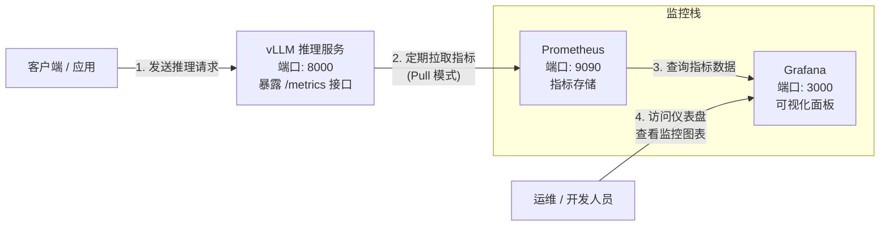

# 监控vLLM推理服务

vLLM （以0.29.0为例）内置了与Prometheus兼容的监控指标接口，无需额外安装Exporter。该版本的监控能力建立在之前版本的基础上，因此以下教程也普遍适用。只需启动vLLM服务，它就会通过/metrics端点自动暴露Prometheus格式的监控数据。本示例对应的内容位于vllm-prometheus目录中，以Docker Compose的方式给出。



### 开始监控

1. 初始设置

   ```bash
   # 切换到vllm-prometheus目录
   cd vllm-prometheus
   
   # 创建服务用到的数据目录
   mkdir -p prometheus/data grafana/data alertmanager/data
   
   # 设置其属主、属组，以确保指定的用户可以正常访问
   chown 1000:1000 prometheus/data alertmanager/data
   chown 472:472 grafana_data/
   ```

2. 修改目标Target（vllm）

   本示例中，监控vLLM Server的配置通过基于文件的服务发现（file-based sd）进行，配置文件放置在prometheus/conf/file_sd_targets目录中的vllm-hosts.yml文件中，请修改vllm相关的目标Target的地址为容器化运行的Prometheus可达的地址。

   ```yaml
   - targets:
       - "172.29.0.165:8000"       # 修改为vLLM Server监听地址和端口
     labels:
       env: "production"           # 可选：附加标签，会合并到采集到的所有指标上
       service: "vllm"             # 可选：便于在 Grafana 中按服务名过滤
   ```

3. 启动服务

   ```bash
   # 获取Image
   docker compose pull
   
   # 启动服务
   docker compose up -d
   ```

4. 导入Grafana Dashboard

   Grafana的Dashboard：25502


### 启动AlertManager

本示例中，alertmanager service上定义了profile，这意味着默认情况下该服务不会启动，需要启动的话，则要将上面的整体启动命令替换为如下：

```
# 启动服务，包括带有profile的alertmanager
docker compose up --profile alert -d
```


### 关键监控指标

通过Prometheus和Grafana，可以监控以下关键指标：

1. 请求与排队
   - vllm:num_requests_running：当前正在处理的请求数。
   - vllm:num_requests_waiting：当前在等待队列中的请求数。
   - vllm:num_requests_swapped：被交换到CPU内存的请求数。

2. 性能与延迟
   - vllm:time_to_first_token_seconds：首Token延迟（TTFT）。
   - vllm:time_per_output_token_seconds：每个输出Token的生成时间（TPOT）。
   - vllm:e2e_request_latency_seconds：端到端请求延迟。

3. 吞吐量
   - vllm:prompt_tokens_total：处理的提示Token总数。
   - vllm:generation_tokens_total：生成的Token总数。

4. 缓存与资源
   - vllm:kv_cache_usage_perc：KV缓存的使用百分比。
   - vllm:gpu_cache_usage_perc：GPU缓存使用百分比。
